# Architecture — WordPress

> Generated by the **Architect** (Reversa) · doc_level `complete`
> WordPress `7.2-alpha-63330` · 1,900 PHP files · ~670,500 LOC · 44 modules
> Confidence: 🟢 CONFIRMED · 🟡 INFERRED · 🔴 GAP

---

## 1. Architectural style

WordPress does not fit a named architecture. It is best described by what it actually is:

> **A procedural PHP monolith with no dependency injection, no ORM and no service layer, whose
> extensibility comes from a global observer registry that wraps essentially every value the system
> computes.**

Five properties define it:

| Property | Manifestation | ADR |
|----------|--------------|-----|
| **Hook-oriented** | 565 actions + 1,638 filters. Even SQL and authorization are filterable. | [001](adrs/001-hooks-as-the-extension-mechanism.md) |
| **Compatibility-absolute** | 9,112 lines of deprecation. Filenames are public API. | [002](adrs/002-never-break-backward-compatibility.md) |
| **Environment-defensive** | Every optional PHP extension has a pure-PHP fallback. | [003](adrs/003-no-orm-hand-rolled-wpdb.md), [006](adrs/006-cron-without-a-daemon.md) |
| **Globally stateful** | `$wpdb`, `$wp_query`, `$wp_rewrite`, `$wp_roles`, `$wp_filter` — process-wide singletons. | — |
| **Degradation-first** | Fatal plugin → paused. Unverifiable update → installed anyway. Malformed block → freeform. | [011](adrs/011-recovery-mode-over-white-screen.md) |

---

## 2. Layered view

```mermaid
flowchart TB
    subgraph OPS["Operations — 9 modules"]
        direction LR
        O1["admin-application"]:::m
        O2["updates-and-upgrader"]:::m
        O3["filesystem-api"]:::m
        O4["site-health"]:::m
        O5["multisite"]:::m
        O6["cron"]:::m
        O7["internationalization"]:::m
        O8["performance-speculation"]:::m
        O9["deprecated-compat"]:::m
    end

    subgraph IFACE["Interfaces — 6 modules"]
        direction LR
        I1["rest-api<br/>49 controllers"]:::m
        I2["http-api<br/>SSRF guard"]:::sec
        I3["xmlrpc<br/>78 methods"]:::risk
        I4["feeds"]:::m
        I5["sitemaps"]:::m
        I6["ai-abilities"]:::m
    end

    subgraph PRES["Presentation & editing — 12 modules"]
        direction LR
        P1["themes-and-templates"]:::m
        P2["block-editor"]:::m
        P3["blocks-library"]:::m
        P4["block-supports"]:::m
        P5["global-styles"]:::m
        P6["style-engine"]:::m
        P7["interactivity-api"]:::m
        P8["script-assets"]:::m
        P9["widgets-nav-menus"]:::m
        P10["customizer"]:::m
        P11["rewrite-permalinks"]:::m
        P12["embeds-oembed"]:::m
    end

    subgraph DOM["Domain — 7 modules"]
        direction LR
        D1["posts-and-post-types"]:::m
        D2["query-and-loop"]:::m
        D3["taxonomy-and-terms"]:::m
        D4["comments"]:::m
        D5["media-attachments"]:::m
        D6["users-roles-caps"]:::sec
        D7["auth-and-sessions"]:::sec
    end

    subgraph KERN["Kernel — 7 modules"]
        direction LR
        K1["bootstrap-and-load"]:::m
        K2["database-wpdb"]:::sec
        K3["options-transients"]:::m
        K4["metadata"]:::m
        K5["formatting"]:::m
        K6["kses-security"]:::sec
        K7["error-recovery"]:::m
    end

    subgraph FOUND["Foundation — 4 modules"]
        direction LR
        F1["hooks-plugin-api"]:::hook
        F2["html-api"]:::m
        F3["cache-object-cache"]:::m
        F4["style-engine-core"]:::m
    end

    OPS --> IFACE --> PRES --> DOM --> KERN --> FOUND
    F1 -.->|"cross-cuts EVERY layer"| OPS

    classDef m fill:#1565c0,color:#fff,stroke:none
    classDef sec fill:#c62828,color:#fff,stroke:none
    classDef risk fill:#ef6c00,color:#fff,stroke:none
    classDef hook fill:#7b1fa2,color:#fff,stroke:none
```

Red = security boundary · Orange = elevated risk · Purple = the mechanism everything depends on.

**The layering is descriptive, not enforced.** Nothing prevents a Layer-0 module from calling a
Layer-5 one; the ordering reflects dependency direction as observed, not as constrained.

---

## 3. The six defining mechanisms

### 3.1 The hook registry 🟢

One implementation serves both actions and filters (F-HOOK-01). Registration is keyed by a string
derived from the callback's type; anything unbuildable is dropped **silently** (BR-HOOK-03).
Execution supports recursion and live re-sorting of the callback list mid-dispatch
(`resort_active_iterations()`, F-HOOK-03).

**Consequence:** no core behavior can be specified in isolation (F-HOOK-06).

### 3.2 Global singletons created at boot 🟢

`wp-settings.php` executes 311 `require` statements and instantiates ten process-wide globals at
fixed line numbers. Plugins depend on the exact position of each, which is why boot order is a
public contract (F-BOOT-01).

### 3.3 Everything is a post 🟢

16 built-in post types, only three of which are user-facing content (ADR-004). Customizer state,
oEmbed cache, GDPR requests, block templates, global styles and font faces are all rows in
`wp_posts`.

### 3.4 Deferred and lazy everything 🟢

Term counts, comment counts, transient expiry, meta cache priming, rewrite flushes and cron all
defer until something asks (DR-05). Nothing happens on a schedule.

### 3.5 Compensating transactions 🟢

`wpdb` exposes no transactions (F-DB-06), so uniqueness is enforced by check-then-act or
insert-then-detect loops. **Every uniqueness guarantee in WordPress is advisory** (F-DOM-04).

### 3.6 Replaceable subsystems 🟢

Five drop-ins replace the database, object cache, page cache, network bootstrap and error handler by
filename, with no interface validation (F-BOOT-03). Thirty-five security functions are replaceable
by definition order (ADR-005).

---

## 4. Cross-cutting concerns

| Concern | Mechanism | Where it can be bypassed |
|---------|-----------|-------------------------|
| **Authorization** | `map_meta_cap()` → primitives → `has_cap()` | `user_has_cap` filter rewrites the entire set (F-CAP-01) |
| **Input handling** | All superglobals slashed by `wp_magic_quotes()` | nothing enforces `wp_unslash()` (F-FMT-05) |
| **Output escaping** | Context-specific `esc_*()` at render | convention only, no type system (F-FMT-02) |
| **HTML filtering** | KSES allowlist, 22 protocols | `unfiltered_html` capability bypasses it entirely (F-KSES-04) |
| **SQL injection** | `wpdb::prepare()` | the `query` filter rewrites any statement (F-DB-02) |
| **SSRF** | `wp_http_validate_url()` | only `wp_safe_remote_*` calls it (F-HTTP-05) |
| **CSRF** | nonces bound to user + action + session | replayable within a 12-hour window (F-AUTH-03) |
| **Caching** | object cache + transients + `alloptions` | request-scoped by default (F-CACHE-01) |
| **i18n** | `__()` family + textdomain registry | source English string is the key (F-I18N-02) |

---

## 5. External integrations

| Integration | Direction | Module | Protection |
|-------------|-----------|--------|-----------|
| `api.wordpress.org` updates | outbound | `updates-and-upgrader` | Ed25519 over SHA-384, degrades to unverified without sodium (BR-FS-07) |
| oEmbed providers | outbound | `embeds-oembed` | 59-provider allowlist; discovery via `wp_safe_remote_get()` |
| RSS/Atom feeds | outbound | `feeds` | HTTP via WP API, sanitized by KSES (BR-FEED-04/05) |
| SMTP mail | outbound | PHPMailer 7.1.1 | `wp_mail()` pluggable |
| AI providers | outbound | `ai-abilities-connectors` | routed through WP HTTP API (BR-AI-09) |
| Pingbacks | **inbound + outbound** | `xmlrpc` | 🔴 unauthenticated server-side fetch (F-XR-03) |
| Search-engine crawlers | inbound | `sitemaps`, `feeds` | `blog_public` option |
| REST consumers | inbound | `rest-api` | per-route `permission_callback` ⚠️ absent ⇒ public |
| XML-RPC clients | inbound | `xmlrpc` | 🔴 credentials per call, no rate limit (F-XR-02) |

---

## 6. Technical debt

Ranked by risk × reach. Every item traces to a numbered finding.

> **Updated 2026-08-21.** The owner answered all ten questions in `questions.md`. Where a decision
> was taken, it is recorded against the item. TD-01, TD-02 and TD-04 are now *decided positions with
> work attached*, not open questions.

### 6.1 High

| # | Debt | Evidence | Reach |
|---|------|----------|-------|
| TD-01 | **Authorization defaults must be made fail-closed.** ✅ **Decided (Q4): deny by default is the house style; the Abilities API is the reference.** Three surfaces deviate: REST route with no `permission_callback` (public), `map_meta_cap()` with no capabilities (allowed), Admin-Ajax `nopriv` (ungated). | F-DOM-02, DR-10, `permissions.md` §7 | every security decision |
| TD-02 | **Admin-Ajax has no declarative authorization at all.** Hundreds of ecosystem actions each re-implement capability and nonce checks. The most common source of WordPress privilege-escalation CVEs. | F-ADM-01 | `admin-application` + all plugins |
| TD-03 | **XML-RPC enabled by default**: 78 methods, credentials on every call, no rate limit, unauthenticated `pingback.ping` SSRF. ⚠️ **Decided (Q3): it stays enabled.** Downgraded to accepted risk — behaviour unchanged. Mitigate at the web server/WAF and via the `xmlrpc_methods` filter rather than by disabling. | F-XR-01…04 | site-wide, always on |
| TD-04 | **KSES still parses HTML with regex** while the HTML API exists in the same codebase. It is the security-critical parser and the one not migrated. ✅ **Decided (Q5): it should be migrated.** Highest priority of the three regex consumers, because its failure mode is a security bypass rather than malformed output. | F-KSES-05, ADR-009 | all untrusted HTML |
| TD-05 | **No transactions anywhere.** Uniqueness is enforced by check-then-act loops with no unique indexes behind them. | F-DB-06, DR-07 | terms, meta, slugs |

### 6.2 Medium

| # | Debt | Evidence | Reach |
|---|------|----------|-------|
| TD-06 | `SQL_CALC_FOUND_ROWS` on by default — every archive page counts the full matching set to render a pager. | F-QUERY-03 | every paginated view |
| TD-07 | `meta_value` unindexed in all six meta tables; `meta_query` is the dominant slow-query source. | F-DD-02, F-META-03 | every meta-filtered query |
| TD-08 | `wpautop()` / `wptexturize()` are regex HTML transformation running on **every rendered post**, the exact problem the HTML API solved. ✅ **In scope of the Q5 migration decision**, second priority after KSES. | F-FMT-04 | all front-end output |
| TD-09 | ~~Cron only runs on visitor traffic; the lock has no atomic compare-and-set without a persistent object cache.~~ ✅ **Resolved by decision.** Q7 sets `DISABLE_WP_CRON` + a system crontab as the target (removes the traffic dependency); Q8 assumes a persistent object cache (gives the lock cross-process semantics). Both properties are out of the target deployment. | F-CRON-01/02 | ~~all scheduled work~~ |
| TD-10 | Four overlapping settings surfaces — Customizer, widgets, nav menus, Site Editor — all maintained. | F-CUST-04 | user confusion, code volume |
| TD-11 | `rewrite_rules` and `cron` are single autoloaded options that grow without bound; `use_verbose_page_rules` makes rules O(pages). | F-RW-02/03, F-CRON-03 | every request |
| TD-12 | Two complete asset systems (classic handles, script modules) with no shared abstraction. | F-ASSET-04 | all enqueued assets |
| TD-13 | `post.php` at 298 KB and `class-wp-customize-manager.php` at 198 KB are the two largest units of coupling. | F-POST-07, F-CUST-03 | maintainability |

### 6.3 Structural (by design, documented for completeness)

| # | Item | Why it is not a defect |
|---|------|----------------------|
| TD-14 | 9,112 lines of deprecation with no sunset dates | ADR-002 — this is the decision that made WordPress ubiquitous |
| TD-15 | No autoloader; every request loads the whole codebase | ADR-001 — boot order is a public contract; `SHORTINIT` is the mitigation |
| TD-16 | Permissive MySQL SQL mode | ADR-007 — required by the draft date representation |
| TD-17 | `level_0`–`level_10` capabilities in every role | ADR-002 — plugins still test for them |

### 6.4 Unassessable from this checkout 🔴

| # | Item | Blocked by |
|---|------|-----------|
| TD-18 | **Test coverage: zero tests in this tree.** No PHPUnit config, no `tests/`, no CI. | Q1 — this is the built distribution, not `wordpress-develop` |
| TD-19 | Block editor client-side behavior — `@wordpress/*` ships as build output only. | Q6 |
| TD-20 | Vendored library currency: 13 PHP libraries with no lockfile and no automated CVE scanning path. | Q9, F-DEP note in `dependencies.md` §8 |

---

## 7. Strengths

An honest architecture assessment must record these as clearly as the debt.

| # | Strength | Evidence |
|---|----------|----------|
| S-01 | **`wp_http_validate_url()`** — 13 IPv4 ranges annotated with RFC intent, cloud metadata named explicitly, sanitize-as-validator round-trip check. The most threat-model-driven code in the system. | F-HTTP-01/02 |
| S-02 | **The HTML API** — a genuine HTML5 tree-construction implementation in PHP that fails loudly on constructs it cannot handle correctly. | F-HTML-01/02 |
| S-03 | **Recovery mode** — detect, attribute, pause, skip, notify, recover. Converts a white screen into a degraded but usable site, with a lockout-proof TTL constraint. | F-ERR-01/02 |
| S-04 | **Block format in HTML comments** — content degrades gracefully; an install with the editor disabled still renders every post. | F-BLK-01 |
| S-05 | **KSES scheme normalization** — four steps, each answering a specific historical XSS bypass, plus depth-capped `feed:` recursion. | F-KSES-01/02 |
| S-06 | **bcrypt pre-hashing** — HMAC-SHA-384 with domain separation and base64 to avoid null bytes; a correct answer to the 72-byte truncation. | F-AUTH-07 |
| S-07 | **The filesystem owner probe** — "can write" and "should write" treated as different questions. | F-FS-01 |
| S-08 | **The Abilities API** — mandatory namespaces, no overwrite, schema-validated input *and output*, private by default. Every core default deliberately inverted. | F-AI-01/02, ADR-012 |
| S-09 | **The style engine and sitemaps modules** — single responsibility per class, no globals, no hooks in the hot path. What core would look like if written today. | F-SE-01, F-SM-01 |
| S-10 | **The autoload enum** — six values preserving the distinction between a human decision and a heuristic, so the heuristic never overrides intent. | F-OPT-02 |

---

## 8. Architectural risks 🟡

| # | Risk | Trigger |
|---|------|---------|
| R-01 | An LLM invokes an Ability whose `permission_callback` was written for a human caller. | Abilities are now reachable by AI agents (F-AI-04) |
| R-02 | DNS rebinding defeats `wp_http_validate_url()` — validation is by resolved IP, the request is by hostname. | F-HTTP-03 |
| R-03 | A hostname resolving to IPv6 is never range-checked; `gethostbyname()` returns IPv4 only. | F-HTTP-04 |
| R-04 | `$super_admins` as a PHP global outranks the database, so a compromised `wp-config.php` or early plugin grants total network control. | F-CAP-08 |
| R-05 | An unbalanced `switch_to_blog()` corrupts every subsequent query in the request. | F-MS-02 |
| R-06 | A `map_meta_cap()` case falling through without emitting a capability grants access silently. | F-CAP-03 |
| R-07 | `rewrite_rules` exceeding 150 KB is auto-demoted from autoload, silently de-optimizing the router. | F-RW-02, BR-OPT-06 |
