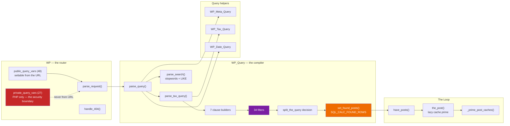
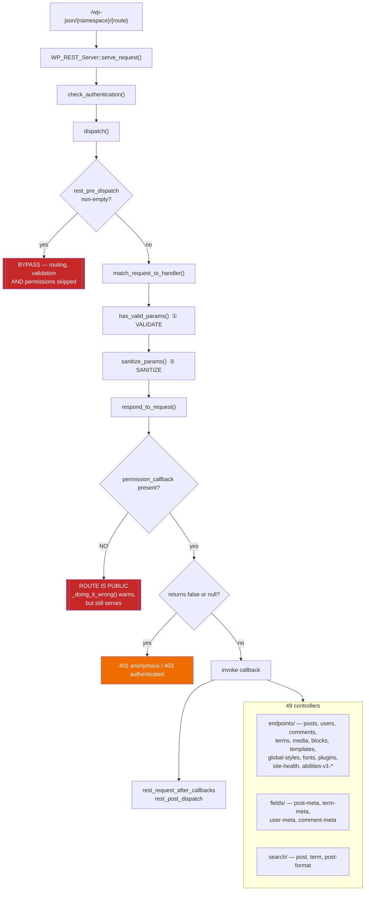
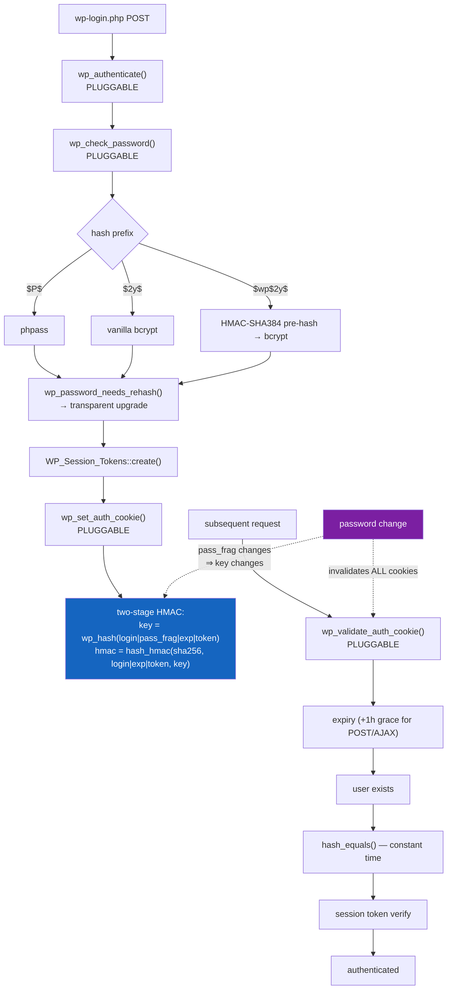

# C4 Level 3 — Components

> Generated by the **Architect** (Reversa) · doc_level `complete`
> The 44 modules from `code-analysis.md`, arranged by dependency layer.
> Confidence: 🟢 CONFIRMED

## The kernel — component map

```mermaid
flowchart TB
    subgraph L0["Layer 0 · Foundation — no internal dependencies"]
        HOOKS["hooks-plugin-api<br/>565 actions · 1,638 filters"]
        HTMLAPI["html-api<br/>HTML5 tree construction"]
        SE["style-engine<br/>CSS rule generation"]
        CACHE["cache-and-object-cache<br/>request-scoped array"]
    end

    subgraph L1["Layer 1 · Kernel"]
        BOOT["bootstrap-and-load<br/>311 requires, 6 checkpoints"]
        DB["database-wpdb<br/>prepare() = the SQL boundary"]
        OPT["options-and-transients<br/>alloptions + notoptions"]
        META["metadata<br/>5 entity types, one code path"]
        FMT["formatting-and-sanitization"]
        KSES["kses-security<br/>22-protocol allowlist"]
        ERR["error-handling-and-recovery-mode"]
    end

    subgraph L2["Layer 2 · Domain"]
        POST["posts-and-post-types<br/>16 types, one table"]
        TAX["taxonomy-and-terms<br/>3-table model"]
        USER["users-roles-capabilities<br/>map_meta_cap()"]
        AUTH["authentication-and-sessions<br/>35 pluggable functions"]
        CMT["comments<br/>4-rule moderation"]
        MEDIA["media-and-attachments"]
        QUERY["query-and-loop<br/>WP_Query, 34 filters"]
        RW["rewrite-and-permalinks"]
    end

    subgraph L3["Layer 3 · Presentation & editing"]
        THEME["themes-and-templates<br/>17 conditionals"]
        BLOCK["block-editor<br/>stack-machine parser"]
        BLIB["blocks-library<br/>115 blocks"]
        BSUP["block-supports<br/>23 modules"]
        GS["global-styles-theme-json<br/>4-origin cascade"]
        INT["interactivity-api"]
        ASSET["script-modules-and-assets"]
        WIDG["widgets-and-nav-menus"]
        CUST["customizer"]
    end

    subgraph L4["Layer 4 · Interfaces"]
        REST["rest-api<br/>49 controllers"]
        HTTP["http-api<br/>13 blocked IP ranges"]
        XR["xmlrpc<br/>78 methods"]
        FEED["feeds"]
        SM["sitemaps"]
        AI["ai-abilities-connectors<br/>schema in AND out"]
    end

    subgraph L5["Layer 5 · Operations"]
        ADMIN["admin-application<br/>95 screens"]
        FS["filesystem-api<br/>owner probe"]
        UPD["updates-and-upgrader"]
        SH["site-health"]
        MS["multisite"]
        CRON["cron<br/>no daemon"]
        I18N["internationalization"]
        PERF["performance-speculation"]
        DEP["deprecated-compat<br/>9,112 lines"]
    end

    HOOKS -.->|"every module"| L1
    HOOKS -.-> L2
    HOOKS -.-> L3
    HOOKS -.-> L4
    HOOKS -.-> L5

    BOOT --> DB
    BOOT --> CACHE
    BOOT --> ERR
    DB --> OPT
    OPT --> CACHE
    META --> DB
    META --> CACHE
    KSES --> FMT

    POST --> DB
    POST --> META
    POST --> TAX
    TAX --> DB
    TAX --> META
    USER --> META
    AUTH --> USER
    CMT --> POST
    CMT --> USER
    CMT --> KSES
    MEDIA --> POST
    MEDIA --> HTMLAPI
    QUERY --> POST
    QUERY --> TAX
    QUERY --> META
    RW --> OPT

    THEME --> QUERY
    BLOCK --> POST
    BLOCK --> HTMLAPI
    BLIB --> BLOCK
    BSUP --> BLOCK
    BSUP --> SE
    GS --> SE
    GS --> POST
    INT --> HTMLAPI
    INT --> ASSET
    CUST --> POST
    WIDG --> OPT

    REST --> USER
    REST --> POST
    HTTP --> KSES
    XR --> AUTH
    FEED --> HTTP
    FEED --> KSES
    SM --> POST
    AI --> REST
    AI --> HTTP

    ADMIN --> AUTH
    UPD --> HTTP
    UPD --> FS
    CRON --> OPT
    CRON --> HTTP
    MS --> DB
    MS --> CACHE
    SH --> HTTP

    style HOOKS fill:#7b1fa2,color:#fff
    style DB fill:#c62828,color:#fff
    style KSES fill:#c62828,color:#fff
    style HTTP fill:#c62828,color:#fff
    style USER fill:#c62828,color:#fff
```

Red = a security boundary. Purple = the mechanism every other component depends on.

---

## Component: `query-and-loop` (the most complex) 🟢

## Component: `rest-api` 🟢

## Component: block rendering pipeline 🟢

```mermaid
flowchart LR
    A["post_content<br/>HTML + comment delimiters"] --> B["parse_blocks()<br/>stack machine, cannot fail"]
    B --> C["for each parsed block"]
    C --> D{"render_callback?"}
    D -->|"no — 18%"| E["saved innerHTML"]
    D -->|"yes — 82%"| F["callback(attrs, content, WP_Block)"]
    E --> G["WP_Block_Supports::apply_block_supports()"]
    F --> G
    G --> H["23 support modules<br/>space-concatenated attributes"]
    H --> I["WP_Style_Engine<br/>class names OR inline styles"]
    I --> J["WP_Theme_JSON merged CSS<br/>default→blocks→theme→custom"]
    J --> K["WP_Interactivity_API::process_directives()<br/>server-side data-wp-* evaluation"]
    K --> L["wp_filter_content_tags()<br/>srcset, sizes, loading, fetchpriority"]
    L --> M["rendered HTML"]

    style B fill:#1565c0,color:#fff
    style K fill:#2e7d32,color:#fff
```

## Component: authentication 🟢

