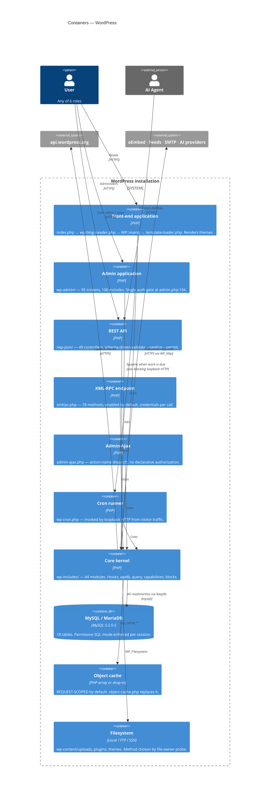
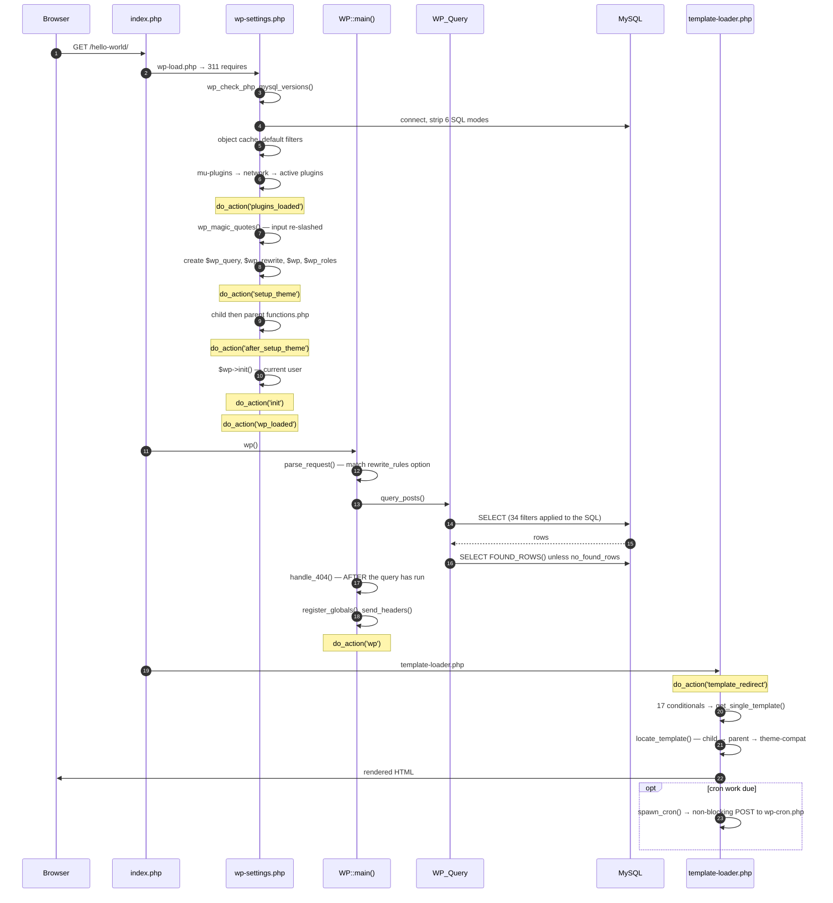

# C4 Level 2 — Containers

> Generated by the **Architect** (Reversa) · doc_level `complete`
> Confidence: 🟢 CONFIRMED unless marked

## The honest picture

WordPress is a **single deployable unit**: PHP files served by a web server, talking to one MySQL
database. There are no services, no queues, no workers. "Containers" here means the deployment
artifacts that actually exist.

## Entry points 🟢

Every one of these boots the full kernel via `wp-load.php` → `wp-settings.php` (311 requires).

| Entry point | Purpose | Auth gate |
|-------------|---------|-----------|
| `index.php` | front-end | none |
| `wp-admin/admin.php` | admin bootstrap | `auth_redirect()` |
| `wp-includes/rest-api.php` → `/wp-json/` | REST | per-route `permission_callback` ⚠️ absent ⇒ public |
| `wp-admin/admin-ajax.php` | AJAX | ⚠️ `nopriv` ⇒ public, no gate |
| `wp-admin/admin-post.php` | form POSTs | per-handler |
| `xmlrpc.php` | XML-RPC | credentials per call |
| `wp-login.php` | authentication | — |
| `wp-cron.php` | scheduler | `doing_cron` transient lock |
| `wp-comments-post.php` | comment submission | duplicate + flood + moderation |
| `wp-trackback.php` | trackbacks | none |
| `wp-signup.php` / `wp-activate.php` | multisite registration | — |
| `wp-mail.php` | post-by-email | POP3 credentials |
| `wp-links-opml.php` | OPML export | none |

## Replaceable containers — the drop-ins 🟢

Five files in `wp-content/` replace a container wholesale, **loaded by filename with no interface
validation** (F-BOOT-03):

| Drop-in | Replaces | Loaded at |
|---------|----------|-----------|
| `db.php` | the entire `wpdb` class | `wp-settings.php:136` |
| `object-cache.php` | `WP_Object_Cache` | `wp-settings.php:151` |
| `advanced-cache.php` | full-page caching | `wp-settings.php:99` |
| `sunrise.php` | network resolution (domain mapping) | `ms-settings.php` |
| `fatal-error-handler.php` | the error template | `class-wp-fatal-error-handler.php:144` |

**`object-cache.php` is the highest-leverage file in a WordPress deployment.** Its presence changes
transient storage (BR-OPT-10), cron lock semantics (F-CRON-02) and the `WP_Query` split-query
optimization (BR-QUERY-07).

## What is absent 🟢

| Expected container | Present? | Consequence |
|--------------------|----------|-------------|
| Application server / worker pool | ❌ | No background processing; cron rides visitor traffic (ADR-006) |
| Message queue | ❌ | The `cron` option is the queue |
| Search index | ❌ | Search is `LIKE '%term%'` (F-QUERY-04) |
| Persistent cache | ❌ by default | Request-scoped array (F-CACHE-01) |
| CDN / asset pipeline | ❌ | Assets served from `wp-includes` / `wp-content` |
| Container definition | ❌ | No Dockerfile in this tree |
| CI pipeline | ❌ | No `.github/` in this tree 🔴 |

## Request flows 🟢

