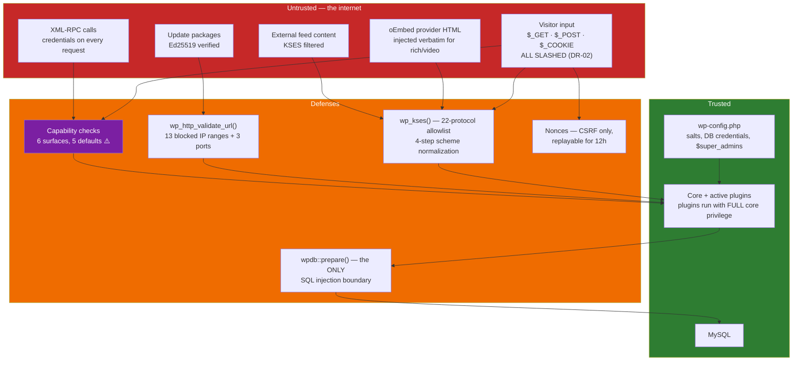

# C4 Level 1 — System Context

> Generated by the **Architect** (Reversa) · WordPress `7.2-alpha-63330`
> Confidence: 🟢 CONFIRMED unless marked

```mermaid
C4Context
    title System Context — WordPress

    Person(visitor, "Visitor", "Reads content, submits comments. Anonymous — shares one nonce value per action.")
    Person(subscriber, "Subscriber", "Authenticated reader. Holds exactly one capability: read.")
    Person(contributor, "Contributor", "Writes own drafts. Cannot publish, cannot upload files.")
    Person(author, "Author", "Publishes own content. 7 capabilities.")
    Person(editor, "Editor", "Manages all content by anyone. 26 capabilities.")
    Person(admin, "Administrator", "Full site control. All 50 primitive capabilities.")
    Person(superadmin, "Super Admin", "Multisite only. Bypasses every capability check except do_not_allow.")
    Person_Ext(agent, "AI Agent", "Discovers and invokes registered Abilities via REST or tool-calling.")

    System(wp, "WordPress", "PHP 7.4+ / MySQL 5.5.5+. 1,900 PHP files, ~670k LOC. 565 actions + 1,638 filters.")

    System_Ext(wporg, "api.wordpress.org", "Core, plugin, theme and translation updates. Ed25519-signed packages.")
    System_Ext(oembed, "oEmbed Providers", "59 registered providers plus link-rel discovery.")
    System_Ext(smtp, "Mail Transport", "PHPMailer 7.1.1 via SMTP or sendmail. wp_mail() is pluggable.")
    System_Ext(feeds, "External Feeds", "RSS/Atom consumed via SimplePie 1.9.0.")
    System_Ext(ai, "AI Providers", "OpenAI-compatible endpoints via the vendored PHP AI Client.")
    System_Ext(browser, "Search Engines & Crawlers", "Consume XML sitemaps, robots.txt and feeds.")
    System_Ext(clients, "XML-RPC Clients", "Legacy blogging clients. 78 methods, credentials per call.")

    Rel(visitor, wp, "Reads, comments", "HTTPS")
    Rel(subscriber, wp, "Reads", "HTTPS")
    Rel(contributor, wp, "Drafts content", "HTTPS / wp-admin")
    Rel(author, wp, "Publishes own content", "HTTPS / wp-admin")
    Rel(editor, wp, "Manages all content", "HTTPS / wp-admin")
    Rel(admin, wp, "Administers site", "HTTPS / wp-admin")
    Rel(superadmin, wp, "Administers network", "HTTPS / wp-admin/network")
    Rel(agent, wp, "Invokes Abilities", "REST /wp-json/wp-abilities/v1/")

    Rel(wp, wporg, "Checks for and downloads updates", "HTTPS, backoff 1min→12h")
    Rel(wp, oembed, "Fetches embed data", "HTTPS, JSON then XML")
    Rel(wp, smtp, "Sends notifications", "SMTP")
    Rel(wp, feeds, "Fetches and caches feeds", "HTTPS, transient-cached")
    Rel(wp, ai, "Sends prompts, receives completions", "HTTPS via WP HTTP API")
    Rel(browser, wp, "Crawls sitemaps and feeds", "HTTPS")
    Rel(clients, wp, "Publishes remotely", "XML-RPC over HTTPS")
```

## Actors 🟢

| Actor | Capabilities | Source |
|-------|-------------|--------|
| Visitor | none; `exist` implicitly | `permissions.md` §2 |
| Subscriber | `read` (1) | `populate_roles_160()` |
| Contributor | `edit_posts`, `delete_posts`, `read` (3) — **no `upload_files`** | `populate_roles_160/210()` |
| Author | 7 capabilities, own content only | `populate_roles_160/210()` |
| Editor | 26 capabilities, all content by anyone | `populate_roles_160/210()` |
| Administrator | all 50 primitives | `populate_roles_*()` |
| Super Admin | bypasses `has_cap()` entirely | `class-wp-user.php:795` |
| AI Agent | whatever each Ability's `permission_callback` allows | `class-wp-ability.php:623` |

## External systems 🟢

| System | Direction | Protocol | Guarded by |
|--------|-----------|----------|-----------|
| `api.wordpress.org` | outbound | HTTPS | Ed25519 signature verification (BR-FS-10) |
| oEmbed providers | outbound | HTTPS | 59-entry allowlist; discovery uses `wp_safe_remote_get()` |
| Mail transport | outbound | SMTP | `wp_mail()` is pluggable (ADR-005) |
| External feeds | outbound | HTTPS | routed through WP HTTP API + KSES (BR-FEED-04/05) |
| AI providers | outbound | HTTPS | `WP_AI_Client_Http_Client` → WP HTTP API (BR-AI-09) |
| Search engines | inbound | HTTPS | `blog_public` option gates sitemaps and robots |
| XML-RPC clients | inbound | XML-RPC | 🔴 **credentials per call, no rate limit** (F-XR-02) |

## Trust boundaries 🟢

**There is no privilege boundary between core and plugins.** A plugin can filter every SQL statement
(BR-DB-05), rewrite every capability check (F-CAP-01), and redefine 35 security functions
(ADR-005). Installing a plugin is granting full trust.
