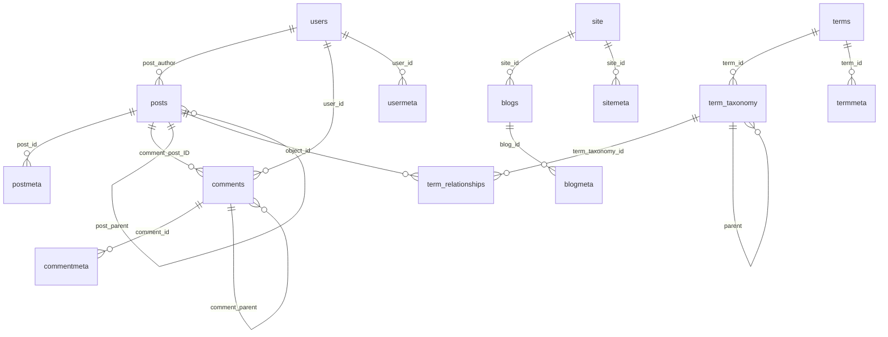

# Data Dictionary — WordPress

> Generated by the **Archaeologist** (Reversa) · doc_level `complete`
> Source of truth: `wp-admin/includes/schema.php` → `wp_get_db_schema()` · DB version **61833**
> Confidence: 🟢 CONFIRMED (read from DDL) · 🟡 INFERRED · 🔴 GAP

---

## 1. Overview

**19 `CREATE TABLE` statements** define **18 distinct tables** (`users` appears twice — once for
single-site and once for multisite, with the same shape).

There is **no ORM, no migration log and no foreign key anywhere in the schema.** Every relationship
below is by convention, enforced in PHP or not at all. `dbDelta()` reconciles the live schema against
these statements by diffing (BR-UPD-08).

### Table scopes 🟢

| Scope | Prefix behavior | Tables |
|-------|----------------|--------|
| **blog** | `wp_` on single-site, `wp_{blog_id}_` per site under multisite | `posts`, `postmeta`, `comments`, `commentmeta`, `terms`, `term_taxonomy`, `term_relationships`, `termmeta`, `links`, `options` |
| **global** | always `wp_` — shared network-wide | `users`, `usermeta` |
| **ms-global** | always `wp_` — multisite only | `blogs`, `blogmeta`, `site`, `sitemeta`, `signups`, `registration_log` |

A 1,000-site network therefore has ~10,000 blog-scoped tables plus 8 shared ones (F-MS-01).

### Charset 🟢

Every table is created with `$charset_collate`, which resolves to `utf8mb4` /
`utf8mb4_unicode_520_ci` where supported (BR-DB-09). `$max_index_length` (191 on utf8mb4) truncates
indexes on `varchar(255)` columns — visible in the `meta_key`, `post_name`, `slug` and `name`
indexes below.

---

## 2. Entity relationships 🟢

**None of these relationships is a database foreign key.** The consequences appear throughout the
analysis: `_menu_item_orphaned` tombstones (BR-MENU-05), the taxonomy ancestor cycle guard
(BR-TAX-13), and duplicate meta rows despite `$unique` (F-META-02).

---

## 3. Tables

### `termmeta`

**Scope:** blog (`wp_` or `wp_{blog_id}_`) · **Columns:** 4 · **Indexes:** 3

Arbitrary key/value attributes for terms.

| Column | Type | Null | Default |
|--------|------|------|---------|
| `meta_id` | `bigint(20) unsigned AUTO_INCREMENT` | no | — |
| `term_id` | `bigint(20) unsigned` | no | `'0'` |
| `meta_key` | `varchar(255)` | yes | `NULL` |
| `meta_value` | `longtext` | yes | — |

**Indexes**

- `PRIMARY KEY  (meta_id)`
- `KEY term_id (term_id)`
- `KEY meta_key (meta_key(max_index_length))`

### `terms`

**Scope:** blog (`wp_` or `wp_{blog_id}_`) · **Columns:** 4 · **Indexes:** 3

The word: a term name and slug, independent of any taxonomy.

| Column | Type | Null | Default |
|--------|------|------|---------|
| `term_id` | `bigint(20) unsigned AUTO_INCREMENT` | no | — |
| `name` | `varchar(200)` | no | `''` |
| `slug` | `varchar(200)` | no | `''` |
| `term_group` | `bigint(10)` | no | `0` |

**Indexes**

- `PRIMARY KEY  (term_id)`
- `KEY slug (slug(max_index_length))`
- `KEY name (name(max_index_length))`

### `term_taxonomy`

**Scope:** blog (`wp_` or `wp_{blog_id}_`) · **Columns:** 6 · **Indexes:** 3

The word AS a classification, with hierarchy and count.

| Column | Type | Null | Default |
|--------|------|------|---------|
| `term_taxonomy_id` | `bigint(20) unsigned AUTO_INCREMENT` | no | — |
| `term_id` | `bigint(20) unsigned` | no | `0` |
| `taxonomy` | `varchar(32)` | no | `''` |
| `description` | `longtext` | no | — |
| `parent` | `bigint(20) unsigned` | no | `0` |
| `count` | `bigint(20)` | no | `0` |

**Indexes**

- `PRIMARY KEY  (term_taxonomy_id)`
- `UNIQUE KEY term_id_taxonomy (term_id,taxonomy)`
- `KEY taxonomy (taxonomy)`

### `term_relationships`

**Scope:** blog (`wp_` or `wp_{blog_id}_`) · **Columns:** 3 · **Indexes:** 2

Assignment of an object to a term_taxonomy_id.

| Column | Type | Null | Default |
|--------|------|------|---------|
| `object_id` | `bigint(20) unsigned` | no | `0` |
| `term_taxonomy_id` | `bigint(20) unsigned` | no | `0` |
| `term_order` | `int(11)` | no | `0` |

**Indexes**

- `PRIMARY KEY  (object_id,term_taxonomy_id)`
- `KEY term_taxonomy_id (term_taxonomy_id)`

### `commentmeta`

**Scope:** blog (`wp_` or `wp_{blog_id}_`) · **Columns:** 4 · **Indexes:** 3

Arbitrary key/value attributes for comments.

| Column | Type | Null | Default |
|--------|------|------|---------|
| `meta_id` | `bigint(20) unsigned AUTO_INCREMENT` | no | — |
| `comment_id` | `bigint(20) unsigned` | no | `'0'` |
| `meta_key` | `varchar(255)` | yes | `NULL` |
| `meta_value` | `longtext` | yes | — |

**Indexes**

- `PRIMARY KEY  (meta_id)`
- `KEY comment_id (comment_id)`
- `KEY meta_key (meta_key(max_index_length))`

### `comments`

**Scope:** blog (`wp_` or `wp_{blog_id}_`) · **Columns:** 15 · **Indexes:** 6

Comments, pingbacks and trackbacks.

| Column | Type | Null | Default |
|--------|------|------|---------|
| `comment_ID` | `bigint(20) unsigned AUTO_INCREMENT` | no | — |
| `comment_post_ID` | `bigint(20) unsigned` | no | `'0'` |
| `comment_author` | `tinytext` | no | — |
| `comment_author_email` | `varchar(100)` | no | `''` |
| `comment_author_url` | `varchar(200)` | no | `''` |
| `comment_author_IP` | `varchar(100)` | no | `''` |
| `comment_date` | `datetime NOT NULL default '0000-00-00 00:00:00'` | yes | — |
| `comment_date_gmt` | `datetime NOT NULL default '0000-00-00 00:00:00'` | yes | — |
| `comment_content` | `text` | no | — |
| `comment_karma` | `int(11)` | no | `'0'` |
| `comment_approved` | `varchar(20)` | no | `'1'` |
| `comment_agent` | `varchar(255)` | no | `''` |
| `comment_type` | `varchar(20)` | no | `'comment'` |
| `comment_parent` | `bigint(20) unsigned` | no | `'0'` |
| `user_id` | `bigint(20) unsigned` | no | `'0'` |

**Indexes**

- `PRIMARY KEY  (comment_ID)`
- `KEY comment_post_ID (comment_post_ID)`
- `KEY comment_approved_date_gmt (comment_approved,comment_date_gmt)`
- `KEY comment_date_gmt (comment_date_gmt)`
- `KEY comment_parent (comment_parent)`
- `KEY comment_author_email (comment_author_email(10))`

### `links`

**Scope:** blog (`wp_` or `wp_{blog_id}_`) · **Columns:** 13 · **Indexes:** 2

Legacy blogroll bookmarks (link manager, hidden since 3.5).

| Column | Type | Null | Default |
|--------|------|------|---------|
| `link_id` | `bigint(20) unsigned AUTO_INCREMENT` | no | — |
| `link_url` | `varchar(255)` | no | `''` |
| `link_name` | `varchar(255)` | no | `''` |
| `link_image` | `varchar(255)` | no | `''` |
| `link_target` | `varchar(25)` | no | `''` |
| `link_description` | `varchar(255)` | no | `''` |
| `link_visible` | `varchar(20)` | no | `'Y'` |
| `link_owner` | `bigint(20) unsigned` | no | `'1'` |
| `link_rating` | `int(11)` | no | `'0'` |
| `link_updated` | `datetime NOT NULL default '0000-00-00 00:00:00'` | yes | — |
| `link_rel` | `varchar(255)` | no | `''` |
| `link_notes` | `mediumtext` | no | — |
| `link_rss` | `varchar(255)` | no | `''` |

**Indexes**

- `PRIMARY KEY  (link_id)`
- `KEY link_visible (link_visible)`

### `options`

**Scope:** blog (`wp_` or `wp_{blog_id}_`) · **Columns:** 4 · **Indexes:** 3

Site configuration, plugin settings and transients.

| Column | Type | Null | Default |
|--------|------|------|---------|
| `option_id` | `bigint(20) unsigned AUTO_INCREMENT` | no | — |
| `option_name` | `varchar(191)` | no | `''` |
| `option_value` | `longtext` | no | — |
| `autoload` | `varchar(20)` | no | `'yes'` |

**Indexes**

- `PRIMARY KEY  (option_id)`
- `UNIQUE KEY option_name (option_name)`
- `KEY autoload (autoload)`

### `postmeta`

**Scope:** blog (`wp_` or `wp_{blog_id}_`) · **Columns:** 4 · **Indexes:** 3

Arbitrary key/value attributes for posts.

| Column | Type | Null | Default |
|--------|------|------|---------|
| `meta_id` | `bigint(20) unsigned AUTO_INCREMENT` | no | — |
| `post_id` | `bigint(20) unsigned` | no | `'0'` |
| `meta_key` | `varchar(255)` | yes | `NULL` |
| `meta_value` | `longtext` | yes | — |

**Indexes**

- `PRIMARY KEY  (meta_id)`
- `KEY post_id (post_id)`
- `KEY meta_key (meta_key(max_index_length))`

### `posts`

**Scope:** blog (`wp_` or `wp_{blog_id}_`) · **Columns:** 23 · **Indexes:** 6

All content: 16 built-in post types in one table.

| Column | Type | Null | Default |
|--------|------|------|---------|
| `ID` | `bigint(20) unsigned AUTO_INCREMENT` | no | — |
| `post_author` | `bigint(20) unsigned` | no | `'0'` |
| `post_date` | `datetime NOT NULL default '0000-00-00 00:00:00'` | yes | — |
| `post_date_gmt` | `datetime NOT NULL default '0000-00-00 00:00:00'` | yes | — |
| `post_content` | `longtext` | no | — |
| `post_title` | `text` | no | — |
| `post_excerpt` | `text` | no | — |
| `post_status` | `varchar(20)` | no | `'publish'` |
| `comment_status` | `varchar(20)` | no | `'open'` |
| `ping_status` | `varchar(20)` | no | `'open'` |
| `post_password` | `varchar(255)` | no | `''` |
| `post_name` | `varchar(200)` | no | `''` |
| `to_ping` | `text` | no | — |
| `pinged` | `text` | no | — |
| `post_modified` | `datetime NOT NULL default '0000-00-00 00:00:00'` | yes | — |
| `post_modified_gmt` | `datetime NOT NULL default '0000-00-00 00:00:00'` | yes | — |
| `post_content_filtered` | `longtext` | no | — |
| `post_parent` | `bigint(20) unsigned` | no | `'0'` |
| `guid` | `varchar(255)` | no | `''` |
| `menu_order` | `int(11)` | no | `'0'` |
| `post_type` | `varchar(20)` | no | `'post'` |
| `post_mime_type` | `varchar(100)` | no | `''` |
| `comment_count` | `bigint(20)` | no | `'0'` |

**Indexes**

- `PRIMARY KEY  (ID)`
- `KEY post_name (post_name(max_index_length))`
- `KEY type_status_date (post_type,post_status,post_date,ID)`
- `KEY post_parent (post_parent)`
- `KEY post_author (post_author)`
- `KEY type_status_author (post_type,post_status,post_author)`

### `users`

**Scope:** global (`wp_` always) · **Columns:** 10 · **Indexes:** 4

User accounts, shared network-wide under multisite.

| Column | Type | Null | Default |
|--------|------|------|---------|
| `ID` | `bigint(20) unsigned AUTO_INCREMENT` | no | — |
| `user_login` | `varchar(60)` | no | `''` |
| `user_pass` | `varchar(255)` | no | `''` |
| `user_nicename` | `varchar(50)` | no | `''` |
| `user_email` | `varchar(100)` | no | `''` |
| `user_url` | `varchar(100)` | no | `''` |
| `user_registered` | `datetime NOT NULL default '0000-00-00 00:00:00'` | yes | — |
| `user_activation_key` | `varchar(255)` | no | `''` |
| `user_status` | `int(11)` | no | `'0'` |
| `display_name` | `varchar(250)` | no | `''` |

**Indexes**

- `PRIMARY KEY  (ID)`
- `KEY user_login_key (user_login)`
- `KEY user_nicename (user_nicename)`
- `KEY user_email (user_email)`

### `usermeta`

**Scope:** global (`wp_` always) · **Columns:** 4 · **Indexes:** 3

User attributes INCLUDING per-site role assignments.

| Column | Type | Null | Default |
|--------|------|------|---------|
| `umeta_id` | `bigint(20) unsigned AUTO_INCREMENT` | no | — |
| `user_id` | `bigint(20) unsigned` | no | `'0'` |
| `meta_key` | `varchar(255)` | yes | `NULL` |
| `meta_value` | `longtext` | yes | — |

**Indexes**

- `PRIMARY KEY  (umeta_id)`
- `KEY user_id (user_id)`
- `KEY meta_key (meta_key(max_index_length))`

### `blogs`

**Scope:** ms-global (`wp_` always) · **Columns:** 12 · **Indexes:** 3

Multisite: one row per site in the network.

| Column | Type | Null | Default |
|--------|------|------|---------|
| `blog_id` | `bigint(20) unsigned AUTO_INCREMENT` | no | — |
| `site_id` | `bigint(20) unsigned` | no | `'0'` |
| `domain` | `varchar(200)` | no | `''` |
| `path` | `varchar(100)` | no | `''` |
| `registered` | `datetime NOT NULL default '0000-00-00 00:00:00'` | yes | — |
| `last_updated` | `datetime NOT NULL default '0000-00-00 00:00:00'` | yes | — |
| `public` | `tinyint(2)` | no | `'1'` |
| `archived` | `tinyint(2)` | no | `'0'` |
| `mature` | `tinyint(2)` | no | `'0'` |
| `spam` | `tinyint(2)` | no | `'0'` |
| `deleted` | `tinyint(2)` | no | `'0'` |
| `lang_id` | `int(11)` | no | `'0'` |

**Indexes**

- `PRIMARY KEY  (blog_id)`
- `KEY domain (domain(50),path(5))`
- `KEY lang_id (lang_id)`

### `blogmeta`

**Scope:** ms-global (`wp_` always) · **Columns:** 4 · **Indexes:** 3

Multisite: per-site metadata.

| Column | Type | Null | Default |
|--------|------|------|---------|
| `meta_id` | `bigint(20) unsigned AUTO_INCREMENT` | no | — |
| `blog_id` | `bigint(20) unsigned` | no | `'0'` |
| `meta_key` | `varchar(255)` | yes | `NULL` |
| `meta_value` | `longtext` | yes | — |

**Indexes**

- `PRIMARY KEY  (meta_id)`
- `KEY meta_key (meta_key(max_index_length))`
- `KEY blog_id (blog_id)`

### `registration_log`

**Scope:** ms-global (`wp_` always) · **Columns:** 5 · **Indexes:** 2

Multisite: log of completed registrations.

| Column | Type | Null | Default |
|--------|------|------|---------|
| `ID` | `bigint(20) unsigned AUTO_INCREMENT` | no | — |
| `email` | `varchar(255)` | no | `''` |
| `IP` | `varchar(30)` | no | `''` |
| `blog_id` | `bigint(20) unsigned` | no | `'0'` |
| `date_registered` | `datetime NOT NULL default '0000-00-00 00:00:00'` | yes | — |

**Indexes**

- `PRIMARY KEY  (ID)`
- `KEY IP (IP)`

### `site`

**Scope:** ms-global (`wp_` always) · **Columns:** 3 · **Indexes:** 2

Multisite: one row per network.

| Column | Type | Null | Default |
|--------|------|------|---------|
| `id` | `bigint(20) unsigned AUTO_INCREMENT` | no | — |
| `domain` | `varchar(200)` | no | `''` |
| `path` | `varchar(100)` | no | `''` |

**Indexes**

- `PRIMARY KEY  (id)`
- `KEY domain (domain(140),path(51))`

### `sitemeta`

**Scope:** ms-global (`wp_` always) · **Columns:** 4 · **Indexes:** 3

Multisite: network-wide options.

| Column | Type | Null | Default |
|--------|------|------|---------|
| `meta_id` | `bigint(20) unsigned AUTO_INCREMENT` | no | — |
| `site_id` | `bigint(20) unsigned` | no | `'0'` |
| `meta_key` | `varchar(255)` | yes | `NULL` |
| `meta_value` | `longtext` | yes | — |

**Indexes**

- `PRIMARY KEY  (meta_id)`
- `KEY meta_key (meta_key(max_index_length))`
- `KEY site_id (site_id)`

### `signups`

**Scope:** ms-global (`wp_` always) · **Columns:** 11 · **Indexes:** 5

Multisite: pending user and site registrations.

| Column | Type | Null | Default |
|--------|------|------|---------|
| `signup_id` | `bigint(20) unsigned AUTO_INCREMENT` | no | — |
| `domain` | `varchar(200)` | no | `''` |
| `path` | `varchar(100)` | no | `''` |
| `title` | `longtext` | no | — |
| `user_login` | `varchar(60)` | no | `''` |
| `user_email` | `varchar(100)` | no | `''` |
| `registered` | `datetime NOT NULL default '0000-00-00 00:00:00'` | yes | — |
| `activated` | `datetime NOT NULL default '0000-00-00 00:00:00'` | yes | — |
| `active` | `tinyint(1)` | no | `'0'` |
| `activation_key` | `varchar(50)` | no | `''` |
| `meta` | `longtext` | yes | — |

**Indexes**

- `PRIMARY KEY  (signup_id)`
- `KEY activation_key (activation_key)`
- `KEY user_email (user_email)`
- `KEY user_login_email (user_login,user_email)`
- `KEY domain_path (domain(140),path(51))`

---

## 4. The key-value layers

Three tables in the schema above are **schemaless stores**, and most of WordPress's actual data model
lives inside them rather than in columns.

### 4.1 `options` — site configuration 🟢

`populate_options()` in `schema.php` seeds **~130 option names** at install. The
operationally significant ones:

| Option | Purpose | Referenced by |
|--------|---------|--------------|
| `siteurl`, `home` | the two URLs (`home` falls back to `siteurl` when empty) | BR-OPT-12 |
| `blogname`, `blogdescription` | site identity | — |
| `blog_public` | search-engine visibility; also gates sitemaps and robots | `sitemaps`, `robots-template` |
| `active_plugins` | ordered list of active plugin files | BR-BOOT-05 |
| `template`, `stylesheet` | parent and child theme directories | `themes-and-templates` |
| `permalink_structure` | the permalink format compiled by `WP_Rewrite` | BR-RW-01 |
| `rewrite_rules` | **the entire compiled routing table** | BR-RW-05, F-RW-02 |
| `cron` | **the entire scheduled-event queue** | BR-CRON-01 |
| `db_version`, `initial_db_version` | schema version markers | BR-UPD-09 |
| `default_role` | role assigned to new users | `users-roles-capabilities` |
| `users_can_register`, `comment_registration` | registration policy | — |
| `comment_moderation`, `comment_previously_approved`, `comment_max_links`, `moderation_keys`, `disallowed_keys` | **the entire comment moderation policy** | BR-CMT-06 … BR-CMT-10 |
| `close_comments_for_old_posts`, `close_comments_days_old` | comment auto-close | — |
| `thumbnail_size_w/h`, `medium_size_w/h`, `medium_large_size_w/h`, `large_size_w/h` | registered image sizes | BR-MEDIA-10 |
| `uploads_use_yearmonth_folders`, `upload_path`, `upload_url_path` | media storage layout | — |
| `timezone_string`, `gmt_offset`, `date_format`, `time_format` | time handling | — |
| `page_on_front`, `page_for_posts`, `show_on_front` | front-page configuration | `query-and-loop` |
| `posts_per_page`, `posts_per_rss` | pagination | BR-QUERY-08 |
| `auto_update_core_major/minor/dev`, `auto_plugin_theme_update_emails` | update policy | `updates-and-upgrader` |
| `mailserver_url/login/pass/port` | post-by-email (`wp-mail.php`) | — |
| `blacklist_keys`, `comment_whitelist` | **deprecated aliases**, transparently remapped | BR-OPT-02 |

**Transients** share this table under the `_transient_*` / `_transient_timeout_*` prefixes
(BR-OPT-08), as do site transients under `_site_transient_*` in `sitemeta`.

### 4.2 `usermeta` — the role store 🟢

Beyond profile fields, `usermeta` carries the **authorization model**:

| Meta key | Purpose |
|----------|---------|
| `{$prefix}capabilities` | serialized `role => true` map — **this is where roles live** (BR-CAP-13) |
| `{$prefix}user_level` | legacy numeric level (BR-CAP-11) |
| `session_tokens` | active login sessions (BR-AUTH-15) |
| `nickname`, `first_name`, `last_name`, `description` | profile |
| `rich_editing`, `syntax_highlighting`, `admin_color`, `show_admin_bar_front` | preferences |
| `locale` | per-user locale (BR-I18N-04) |
| `dismissed_wp_pointers`, `wp_user_settings` | UI state |

Under multisite one user row has `wp_capabilities`, `wp_3_capabilities`, `wp_7_capabilities`… — one
per site they belong to (F-MS-04).

### 4.3 `postmeta` — the extension surface 🟢

Protected keys (leading `_`, BR-META-04) used by core:

| Meta key | Owner module | Purpose |
|----------|-------------|---------|
| `_wp_page_template` | `themes-and-templates` | custom page template slug (BR-TPL-11) |
| `_thumbnail_id` | `media-and-attachments` | featured image attachment id |
| `_wp_attached_file` | `media-and-attachments` | attachment path relative to uploads |
| `_wp_attachment_metadata` | `media-and-attachments` | dimensions, subsizes, EXIF |
| `_wp_attachment_image_alt` | `media-and-attachments` | alt text |
| `_edit_lock`, `_edit_last` | `admin-application` | post locking |
| `_menu_item_*` (9 keys) | `widgets-and-nav-menus` | **the entire menu item model** (BR-MENU-02) |
| `_wp_old_slug`, `_wp_old_date` | `rewrite-and-permalinks` | redirect old permalinks |
| `_wp_trash_meta_status`, `_wp_trash_meta_time` | `posts-and-post-types` | restore state on untrash |
| `_wp_desired_post_slug` | `posts-and-post-types` | slug requested before publish |

---

## 5. Legacy and non-DDL tables 🟢

| Table | Status |
|-------|--------|
| `links` | Created at install but the Link Manager UI is hidden since 3.5 unless `link_manager_enabled`. Dead weight in every install. |
| `registration_log` | Multisite registration log; declared on `wpdb` and created, but rarely read. |
| `sitecategories` | Declared in `$old_ms_global_tables`; **no `CREATE TABLE`** — a legacy name preserved for compatibility only. |
| `categories`, `post2cat`, `link2cat` | `$old_tables` on `wpdb`; pre-2.3 taxonomy schema. Never created; names exist so upgrade routines can detect and migrate them. |

---

## 6. Findings

| # | Finding | Confidence |
|---|---------|-----------|
| F-DD-01 | **No foreign keys exist anywhere.** Every relationship is enforced in PHP, or not at all. This is why orphan tombstones, cycle guards and duplicate-detection loops appear across the codebase. | 🟢 |
| F-DD-02 | **`meta_value` is never indexed** in any of the four meta tables. Only `meta_key` is, and truncated to 191 bytes. Every `meta_query` value comparison is therefore unindexed (F-META-03). | 🟢 |
| F-DD-03 | The `options` table holds site config, plugin settings, the **routing table**, the **cron queue** and the transient cache — with one unique index on `option_name`. It is the most contended table in WordPress (F-OPT-01). | 🟢 |
| F-DD-04 | `posts` carries 6 indexes including two composite ones (`type_status_date`, `type_status_author`) chosen precisely for `WP_Query`'s default clauses. The schema is tuned for exactly one query builder. | 🟢 |
| F-DD-05 | `term_taxonomy` has the **only `UNIQUE KEY` on a semantic pair** in the whole schema (`term_id, taxonomy`) — yet `wp_insert_term()` still does insert-then-detect-duplicate because that constraint does not cover the `(slug, parent, taxonomy)` case it actually guards (F-TAX-02). | 🟢 |
| F-DD-06 | `comments.comment_author_email` is indexed to only **10 characters**, so the flood-control and previously-approved lookups (BR-CMT-03, BR-CMT-09) scan a wide prefix bucket. | 🟢 |
| F-DD-07 | Three tables (`links`, `registration_log`, and the declared-but-uncreated legacy names) exist for compatibility with features effectively retired. | 🟢 |
| F-DD-08 | `$max_index_length` truncation means `meta_key`, `post_name`, term `slug` and term `name` indexes cover only the first 191 bytes under utf8mb4 — long keys sharing a prefix collide into the same index entry. | 🟢 |
| F-DD-09 | `options.autoload` is indexed, which is what makes the single `wp_load_alloptions()` query fast — the one place the schema explicitly optimizes for the caching layer. | 🟢 |
| F-DD-10 | Multisite has no schema-level concept of a site boundary: isolation is purely the table-name prefix, so a query with a hardcoded prefix silently crosses sites. | 🟢 |
