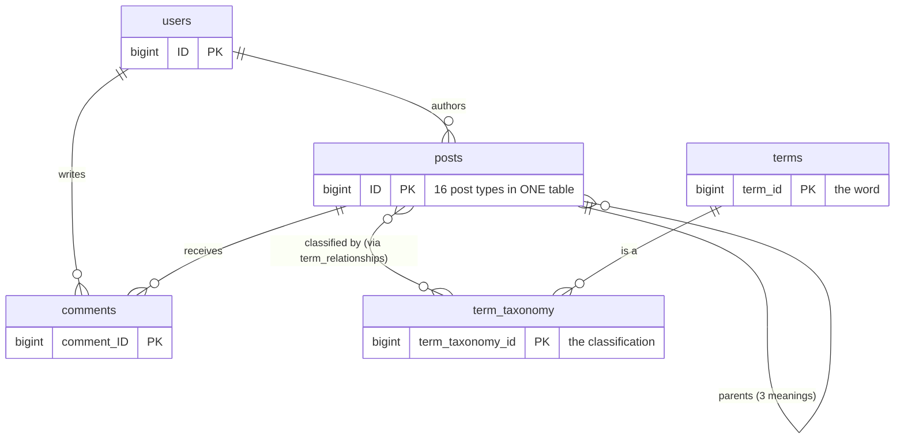
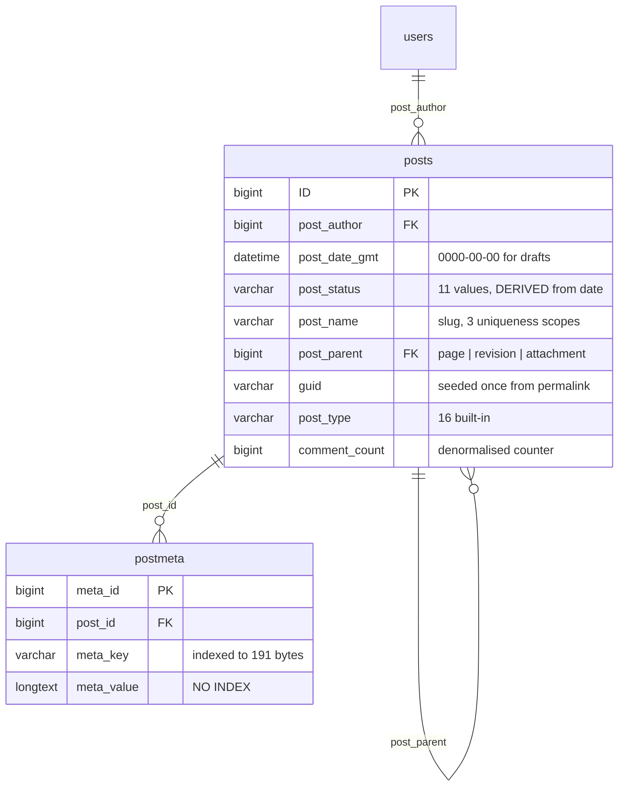
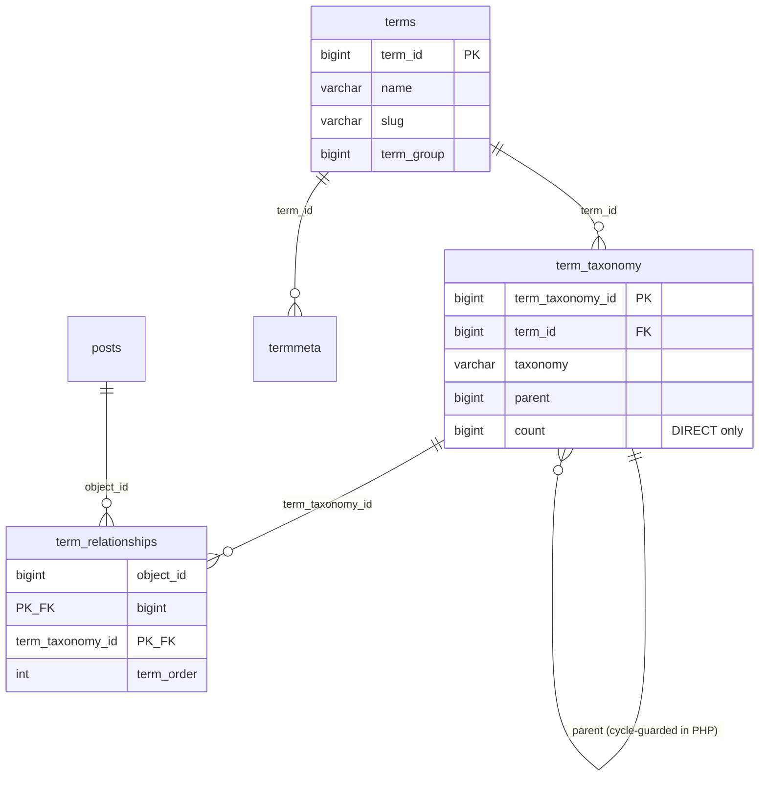
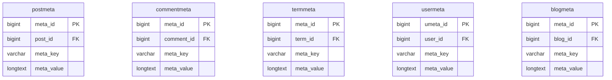
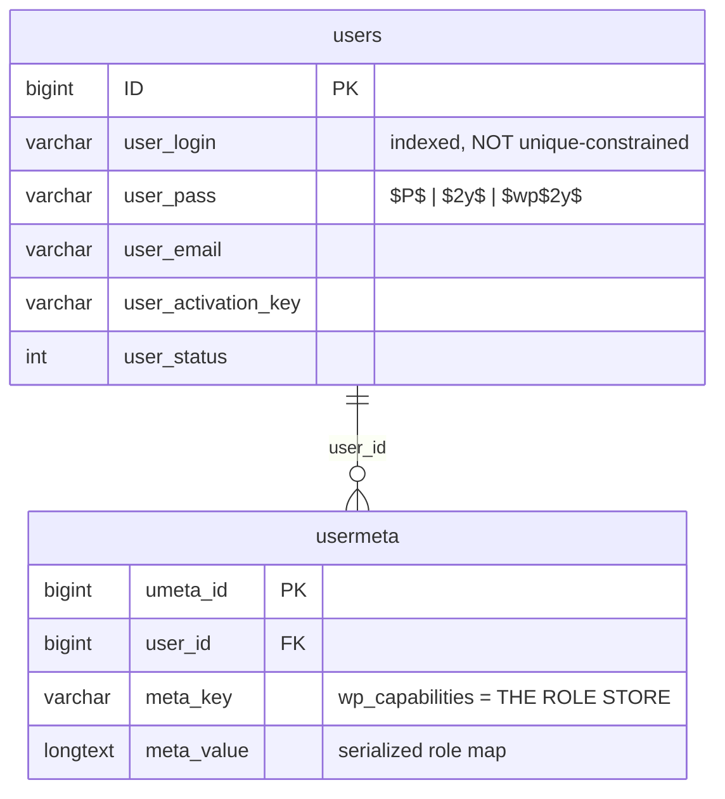
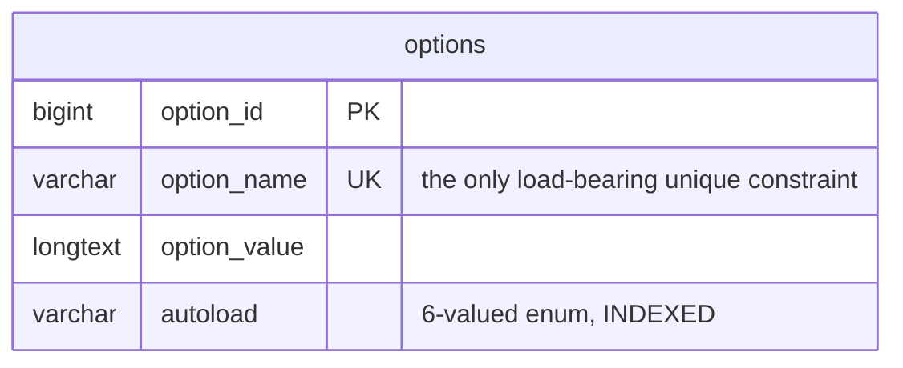
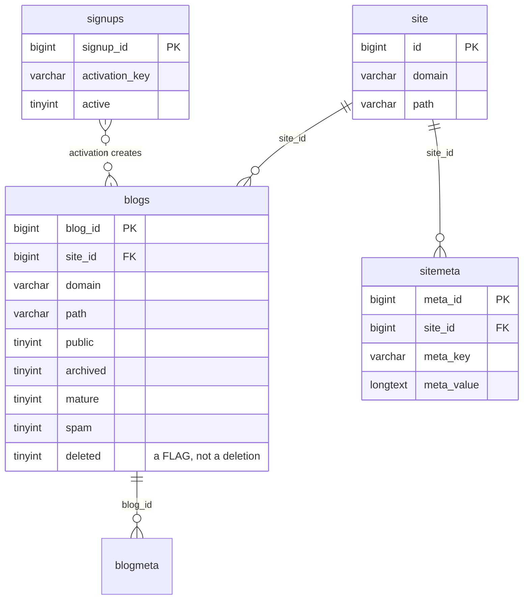

# ERD — WordPress

> Generated by the **Data Master** (Reversa)
>
> **The complete, column-level ERD is in [`../erd-complete.md`](../erd-complete.md)**, produced by
> the Architect. This file provides the domain-partitioned views the Data Master's remit calls for,
> without duplicating that content.

---

## 1. Simplified overall ERD 🟢

Four meta tables (`postmeta`, `commentmeta`, `termmeta`, `usermeta`) hang off the four entities and
are omitted here for legibility — see §2.3.

---

## 2. Domain partitions

### 2.1 Content 🟢

### 2.2 Classification 🟢

### 2.3 Metadata — one shape, five tables 🟢

🟢 Identical but for `usermeta`'s `umeta_id`. All five are served by one code path in `meta.php`
(F-META-01).

### 2.4 Identity and access 🟢

⚠️ 🟢 **There is no role table.** Authorization is a serialized array in a `usermeta` row.

### 2.5 Configuration 🟢

🟢 This one table holds site configuration, plugin settings, **the entire rewrite rule set**, **the
entire cron queue**, and the transient cache (F-OPT-01, F-RW-02, F-CRON-03).

### 2.6 Multisite 🟢

🟢 Five independent boolean flags rather than a status enum — 32 representable states, a handful
meaningful (F-ERD-06).

---

## 3. What no diagram can show 🟢

| Relationship | Why it is invisible |
|--------------|--------------------|
| Site → its content | Encoded in the **table name prefix**, not a column |
| User → role on a site | Encoded in a **meta key name**, `wp_{prefix}capabilities` |
| Menu item → its target | Nine `_menu_item_*` meta rows, not columns (BR-MENU-02) |
| Attachment → its file | `_wp_attached_file` meta pointing at the filesystem |
| Any of the above → integrity | **Nothing.** No foreign key exists anywhere (F-DD-01) |
