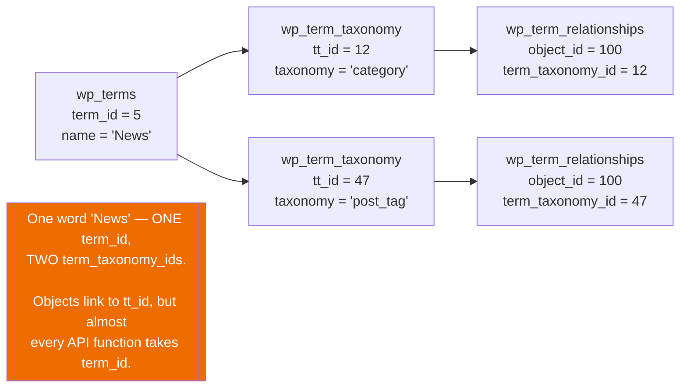

# Relationships — WordPress

> Generated by the **Data Master** (Reversa)
> **No relationship below is a database foreign key.** Every one is a convention enforced in PHP,
> or not at all (F-DD-01).
> Confidence: 🟢 CONFIRMED (columns read from DDL, enforcement read from code)

---

## 1. Relationship catalogue

| # | From | To | Via | Cardinality | Enforced by | On delete |
|---|------|----|----|-------------|-------------|-----------|
| R-01 | `users` | `posts` | `post_author` | 1:N | nothing | `wp_delete_user()` reassigns or deletes 🟢 |
| R-02 | `users` | `comments` | `user_id` | 0..1:N | nothing | `user_id` left as-is; `0` means anonymous 🟡 |
| R-03 | `users` | `usermeta` | `user_id` | 1:N | nothing | `delete_metadata()` in `wp_delete_user()` |
| R-04 | `posts` | `postmeta` | `post_id` | 1:N | nothing | explicit delete in `wp_delete_post()` |
| R-05 | `posts` | `comments` | `comment_post_ID` | 1:N | nothing | explicit delete in `wp_delete_post()` |
| R-06 | `posts` | `posts` | `post_parent` | 1:N self | nothing | **three distinct meanings**, see §2 |
| R-07 | `posts` | `term_relationships` | `object_id` | 1:N | nothing | `wp_delete_object_term_relationships()` |
| R-08 | `comments` | `commentmeta` | `comment_id` | 1:N | nothing | explicit delete |
| R-09 | `comments` | `comments` | `comment_parent` | 1:N self | nothing | threading; orphans possible 🟡 |
| R-10 | `terms` | `term_taxonomy` | `term_id` | 1:N | `UNIQUE (term_id, taxonomy)` | one word, many classifications |
| R-11 | `terms` | `termmeta` | `term_id` | 1:N | nothing | explicit delete |
| R-12 | `term_taxonomy` | `term_relationships` | `term_taxonomy_id` | 1:N | composite PK | **the actual linking id** |
| R-13 | `term_taxonomy` | `term_taxonomy` | `parent` | 1:N self | nothing | **cycle-guarded in PHP** (BR-TAX-13) |
| R-14 | `posts` ↔ `term_taxonomy` | — | `term_relationships` | **N:M** | composite PK | the only true join table |
| R-15 | `site` | `blogs` | `site_id` | 1:N | nothing | multisite |
| R-16 | `site` | `sitemeta` | `site_id` | 1:N | nothing | network options |
| R-17 | `blogs` | `blogmeta` | `blog_id` | 1:N | nothing | per-site metadata |
| R-18 | `blogs` | *(table set)* | prefix `wp_{blog_id}_` | 1:1 | **naming convention only** | `wp_delete_site()` drops the tables |

---

## 2. `post_parent` carries three unrelated meanings 🟢

One column, no discriminator beyond `post_type`:

| When `post_type` is… | `post_parent` means | Set by |
|----------------------|--------------------|--------|
| `page` (or any hierarchical type) | the **parent page** | the page-attributes UI |
| `revision` | the **post being revised** | `wp_save_post_revision()` |
| `attachment` | the **post the file was uploaded to** | the media uploader |
| `nav_menu_item` | **nothing** — hierarchy lives in `_menu_item_menu_item_parent` meta (BR-MENU-03) | — |

🟢 Any query joining `posts` to itself on `post_parent` **must** also filter `post_type`, or it will
mix pages with revisions and attachments (F-ERD-04).

---

## 3. The `term_id` / `term_taxonomy_id` trap 🟢

The most consequential modelling detail in the schema:



🟢 This is correct normalization that the API then obscures. It is the dominant defect source in the
taxonomy module (F-TAX-01, F-ERD-03).

---

## 4. Polymorphic relationships 🟢

The four meta tables are **structurally identical and dispatched by string**:

```php
_get_meta_table( $type )  →  $wpdb->{$type . 'meta'}
```

| `$meta_type` | Table | Object column | PK |
|--------------|-------|---------------|-----|
| `post` | `postmeta` | `post_id` | `meta_id` |
| `comment` | `commentmeta` | `comment_id` | `meta_id` |
| `term` | `termmeta` | `term_id` | `meta_id` |
| `user` | `usermeta` | `user_id` | **`umeta_id`** ⚠️ |
| `blog` | `blogmeta` | `blog_id` | `meta_id` |

🟢 `usermeta` is the outlier — its primary key is `umeta_id`, not `meta_id`, which
`update_meta_cache()` special-cases when ordering (BR-META-10).

This is polymorphism by **table naming**, not by a type column. An unknown `$meta_type` resolves to a
non-existent `wpdb` property and the operation aborts (BR-META-01).

---

## 5. Multisite: relationships that are not columns 🟢

| Relationship | Expressed as |
|--------------|-------------|
| Site → its content | **the table-name prefix**, `wp_{blog_id}_posts` |
| User → their role on a site | **a meta key name**, `wp_{prefix}capabilities` |
| Network → its sites | `blogs.site_id` |

🟢 Two of the three are encoded in **identifiers**, not data. A query with a hardcoded prefix
silently crosses site boundaries (F-DD-10), and role membership cannot be queried relationally
without constructing meta-key names.

---

## 6. Orphan handling 🟢

With no cascading deletes, orphans are handled three different ways:

| Strategy | Example |
|----------|---------|
| **Explicit deletion** | `wp_delete_post()` removes postmeta, comments, commentmeta and term relationships |
| **Tombstone** | `_menu_item_orphaned` marks a menu item whose target is gone (BR-MENU-05) |
| **Tolerate** | A comment whose `user_id` points at a deleted user still renders, using its stored author name 🟡 |

---

## 7. Findings

| # | Finding | Confidence |
|---|---------|-----------|
| F-REL-01 | 18 relationships, **zero foreign keys**. Referential integrity is entirely a PHP responsibility. | 🟢 |
| F-REL-02 | `post_parent` carries three unrelated meanings, disambiguated only by `post_type`. | 🟢 |
| F-REL-03 | Objects link to terms by `term_taxonomy_id` while the API speaks `term_id` — correct normalization, leaky abstraction. | 🟢 |
| F-REL-04 | Meta polymorphism is dispatched by table name, with `usermeta`'s `umeta_id` as the one inconsistency. | 🟢 |
| F-REL-05 | Multisite encodes two of its three key relationships in **identifiers** rather than data, so they cannot be queried relationally. | 🟢 |
