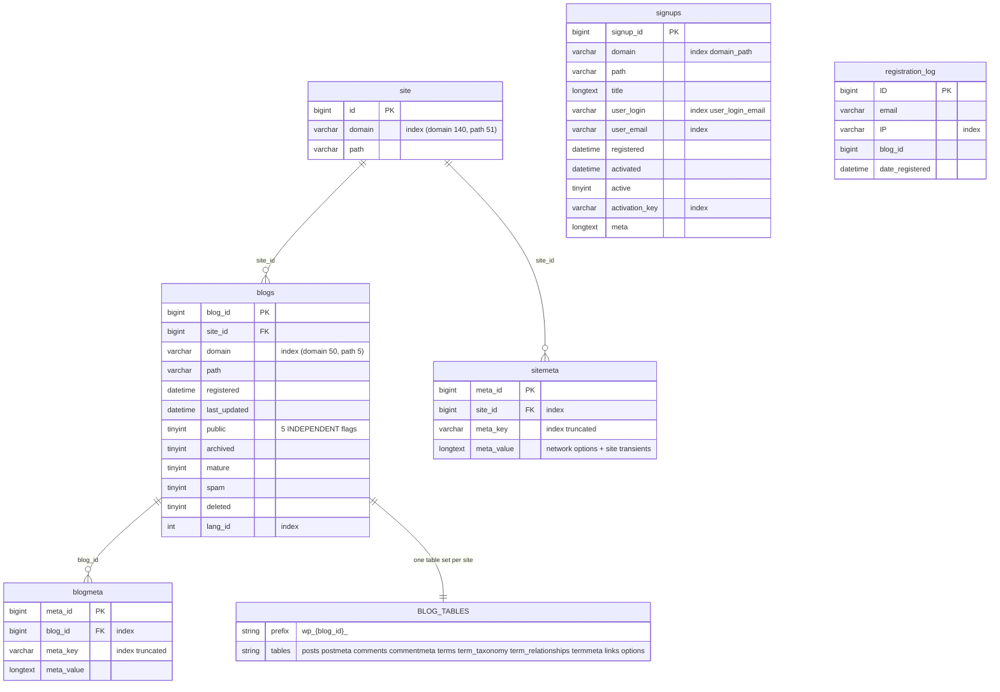

# Complete ERD — WordPress

> Generated by the **Architect** (Reversa) · doc_level `complete`
> Source: `wp-admin/includes/schema.php` · DB version **61833**
> Confidence: 🟢 CONFIRMED (read from DDL)

> **No foreign keys exist anywhere in this schema.** Every relationship below is a convention
> enforced in PHP, or not at all (F-DD-01).

---

## 1. Single-site schema

```mermaid
erDiagram
    users ||--o{ posts : "post_author"
    users ||--o{ comments : "user_id (0 = anonymous)"
    users ||--o{ usermeta : "user_id"

    posts ||--o{ postmeta : "post_id"
    posts ||--o{ comments : "comment_post_ID"
    posts ||--o{ posts : "post_parent (pages, revisions, attachments)"
    posts ||--o{ term_relationships : "object_id"

    comments ||--o{ commentmeta : "comment_id"
    comments ||--o{ comments : "comment_parent (threading)"

    terms ||--o{ term_taxonomy : "term_id — one word, many taxonomies"
    terms ||--o{ termmeta : "term_id"
    term_taxonomy ||--o{ term_relationships : "term_taxonomy_id — THE linking id"
    term_taxonomy ||--o{ term_taxonomy : "parent (no FK — cycles possible)"

    users {
        bigint ID PK
        varchar user_login UK "index: user_login_key"
        varchar user_pass "$P$ | $2y$ | $wp$2y$"
        varchar user_nicename "index"
        varchar user_email "index"
        varchar user_url
        datetime user_registered
        varchar user_activation_key
        int user_status
        varchar display_name
    }

    usermeta {
        bigint umeta_id PK "NOT meta_id"
        bigint user_id FK "index"
        varchar meta_key "index truncated to 191 bytes"
        longtext meta_value "NO INDEX"
    }

    posts {
        bigint ID PK
        bigint post_author FK "index"
        datetime post_date
        datetime post_date_gmt "0000-00-00 for drafts"
        longtext post_content
        text post_title
        text post_excerpt
        varchar post_status "11 values, DERIVED from date"
        varchar comment_status
        varchar ping_status
        varchar post_password
        varchar post_name "the slug, index truncated"
        text to_ping
        text pinged
        datetime post_modified
        datetime post_modified_gmt
        longtext post_content_filtered
        bigint post_parent FK "index"
        varchar guid "seeded from permalink ONCE"
        int menu_order
        varchar post_type "16 built-in values"
        varchar post_mime_type
        bigint comment_count
    }

    postmeta {
        bigint meta_id PK
        bigint post_id FK "index"
        varchar meta_key "index truncated to 191 bytes"
        longtext meta_value "NO INDEX — root of slow meta_query"
    }

    comments {
        bigint comment_ID PK
        bigint comment_post_ID FK "index"
        tinytext comment_author
        varchar comment_author_email "index — only 10 CHARS"
        varchar comment_author_url
        varchar comment_author_IP
        datetime comment_date
        datetime comment_date_gmt "index"
        text comment_content
        int comment_karma "legacy, no consumer"
        varchar comment_approved "1|0|spam|trash|post-trashed"
        varchar comment_agent
        varchar comment_type "comment|pingback|trackback"
        bigint comment_parent FK "index"
        bigint user_id FK
    }

    commentmeta {
        bigint meta_id PK
        bigint comment_id FK "index"
        varchar meta_key "index truncated"
        longtext meta_value "NO INDEX"
    }

    terms {
        bigint term_id PK
        varchar name "index truncated"
        varchar slug "index truncated"
        bigint term_group "alias_of synonyms, vestigial"
    }

    term_taxonomy {
        bigint term_taxonomy_id PK "objects link to THIS"
        bigint term_id FK "UNIQUE (term_id, taxonomy)"
        varchar taxonomy "index"
        longtext description
        bigint parent "hierarchy, NO FK"
        bigint count "DIRECT assignments only"
    }

    term_relationships {
        bigint object_id PK_FK "composite PK"
        bigint term_taxonomy_id PK_FK "index"
        int term_order
    }

    termmeta {
        bigint meta_id PK
        bigint term_id FK "index"
        varchar meta_key "index truncated"
        longtext meta_value "NO INDEX"
    }

    options {
        bigint option_id PK
        varchar option_name UK "the ONLY unique index that matters"
        longtext option_value
        varchar autoload "6-valued enum, INDEXED"
    }

    links {
        bigint link_id PK
        varchar link_url
        varchar link_name
        varchar link_image
        varchar link_target
        varchar link_description
        varchar link_visible "index"
        bigint link_owner
        int link_rating
        datetime link_updated
        varchar link_rel
        mediumtext link_notes
        varchar link_rss
    }
```

## 2. Multisite additions



**`users` and `usermeta` remain global**, shared across the entire network (BR-MS-01). A 1,000-site
network has ~10,000 blog-scoped tables plus 8 shared ones.

---

## 3. Cardinalities 🟢

| Relationship | Cardinality | Enforced by |
|--------------|-------------|-------------|
| `users` → `posts` | 1:N | `post_author`, PHP only |
| `posts` → `postmeta` | 1:N | `post_id`, PHP only |
| `posts` → `posts` | 1:N self | `post_parent` — pages, revisions, attachments |
| `posts` ↔ `term_taxonomy` | **N:M** | via `term_relationships` (composite PK) |
| `terms` → `term_taxonomy` | 1:N | one word, many classifications |
| `term_taxonomy` → `term_taxonomy` | 1:N self | `parent`, **cycle-guarded in PHP** (BR-TAX-13) |
| `posts` → `comments` | 1:N | `comment_post_ID` |
| `comments` → `comments` | 1:N self | `comment_parent` — threading |
| `users` → `comments` | 0..1:N | `user_id = 0` for anonymous |
| `site` → `blogs` | 1:N | multisite |

---

## 4. Index analysis 🟢

| Table | Indexes | Designed for |
|-------|---------|-------------|
| `posts` | `post_name`, **`type_status_date(post_type,post_status,post_date,ID)`**, `post_parent`, `post_author`, **`type_status_author`** | The two composite indexes match `WP_Query`'s default WHERE + ORDER BY exactly. The schema is tuned for one query builder (F-DD-04). |
| `options` | `option_name` UNIQUE, **`autoload`** | The `autoload` index is what makes the single `wp_load_alloptions()` query fast — the one place the schema optimizes for the caching layer (F-DD-09). |
| `term_taxonomy` | **`UNIQUE (term_id, taxonomy)`**, `taxonomy` | The only `UNIQUE KEY` on a semantic pair in the schema — yet it does not cover `(slug, parent, taxonomy)`, which is why `wp_insert_term()` still does insert-then-detect (F-DD-05). |
| `comments` | `comment_post_ID`, `comment_approved_date_gmt`, `comment_date_gmt`, `comment_parent`, **`comment_author_email(10)`** | The email index covers only 10 characters, so flood control and previously-approved lookups scan a wide prefix bucket (F-DD-06). |
| all `*meta` | `{object}_id`, `meta_key(191)` | **`meta_value` is never indexed.** Every `meta_query` value comparison is unindexed (F-DD-02). |
| `term_relationships` | composite PK `(object_id, term_taxonomy_id)`, `term_taxonomy_id` | Bidirectional lookup |

### Index truncation 🟢

`$max_index_length` = **191** under utf8mb4 (767 bytes ÷ 4). Truncated indexes:
`postmeta.meta_key`, `usermeta.meta_key`, `commentmeta.meta_key`, `termmeta.meta_key`,
`blogmeta.meta_key`, `sitemeta.meta_key`, `posts.post_name`, `terms.slug`, `terms.name`.

Long keys sharing a 191-byte prefix collide into the same index entry (F-DD-08).

---

## 5. Findings

| # | Finding | Confidence |
|---|---------|-----------|
| F-ERD-01 | Zero foreign keys. Every referential guarantee is PHP-side, which is why orphan tombstones, cycle guards and duplicate-detection loops appear throughout the codebase. | 🟢 |
| F-ERD-02 | `meta_value` unindexed in all six meta tables makes `meta_query` the dominant cause of slow WordPress queries. | 🟢 |
| F-ERD-03 | The `terms` / `term_taxonomy` / `term_relationships` split is the schema's best normalization and the API's worst abstraction leak: functions take `term_id`, relationships use `term_taxonomy_id`. | 🟢 |
| F-ERD-04 | `posts` self-references for three different purposes (page hierarchy, revision parent, attachment parent) through one column with no discriminator beyond `post_type`. | 🟢 |
| F-ERD-05 | Multisite has no schema-level site boundary — isolation is purely the table-name prefix, so a query with a hardcoded prefix silently crosses sites (F-DD-10). | 🟢 |
| F-ERD-06 | `wp_blogs` carries five independent boolean flags rather than a status enum, making 32 states representable and only a handful meaningful. | 🟡 |
