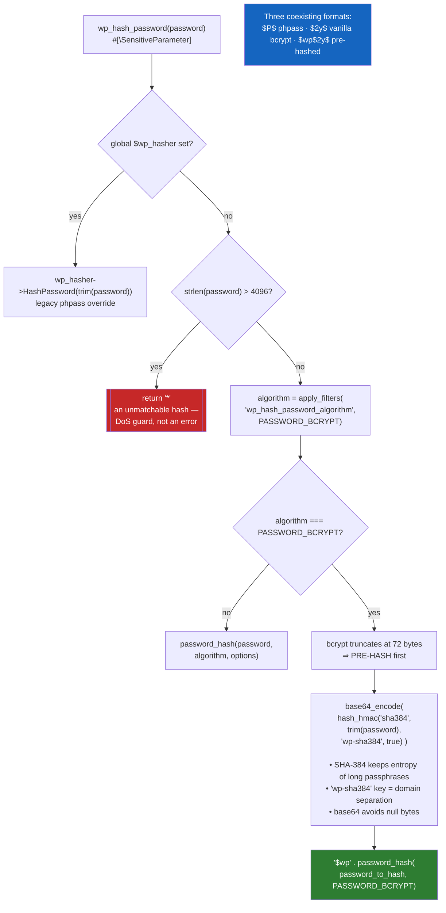
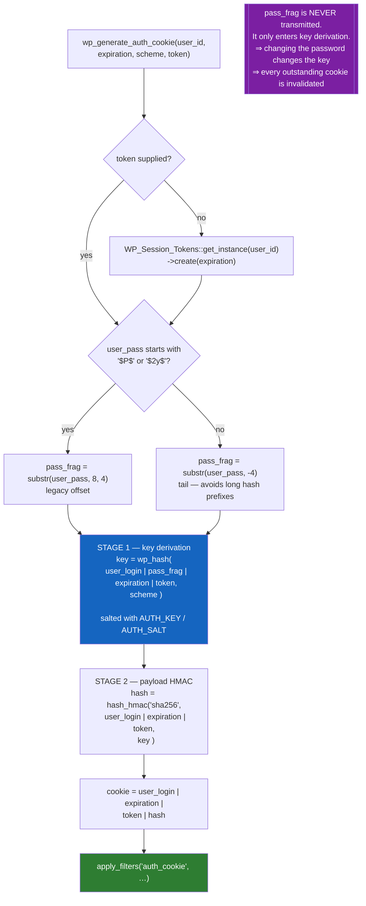
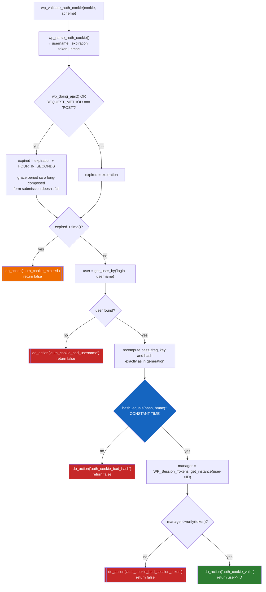
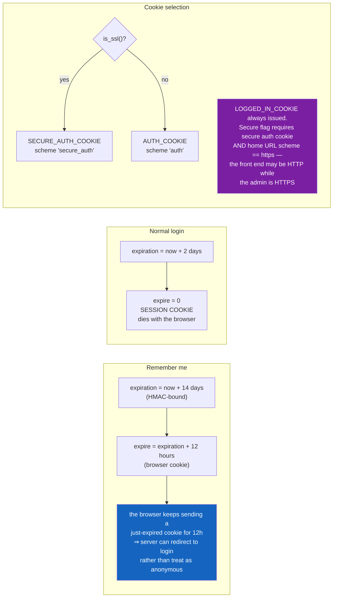
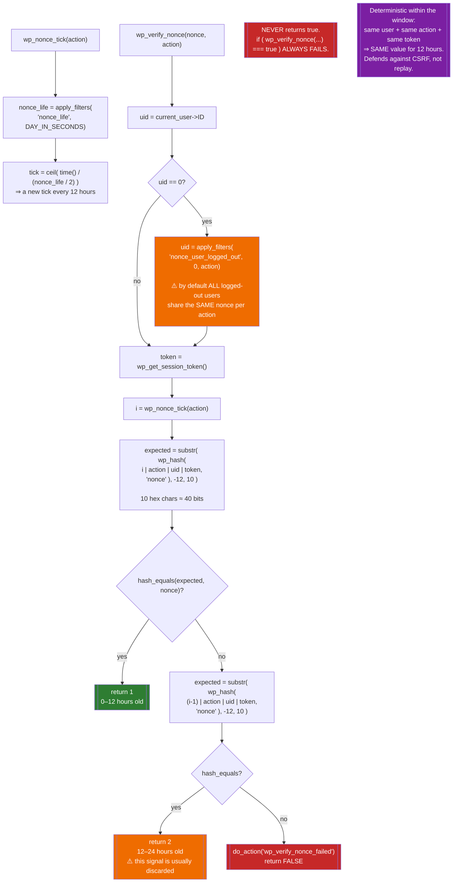
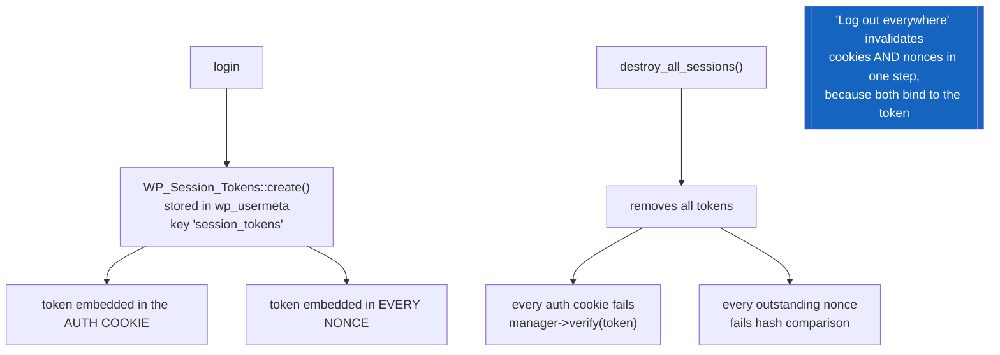

# Flowchart — `authentication-and-sessions`

> 🟢 CONFIRMED — derived from `wp-includes/pluggable.php`

## Password hashing

## Auth cookie generation — two-stage HMAC

## Auth cookie validation

## Cookie lifetimes

## Nonces — time-windowed HMACs, not nonces

## Session tokens tie it together

