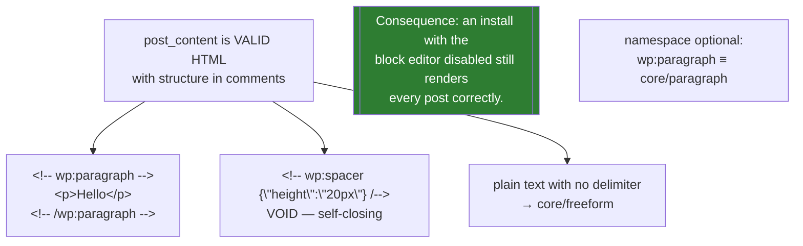
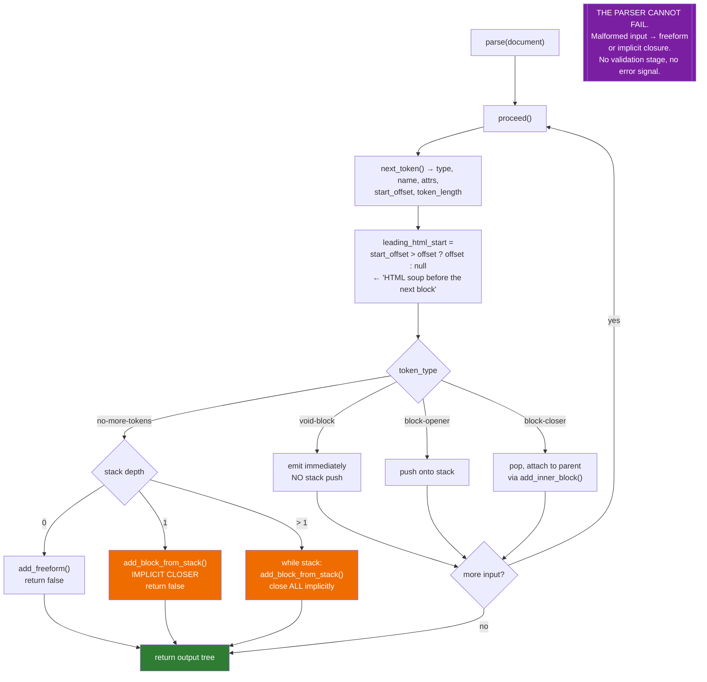
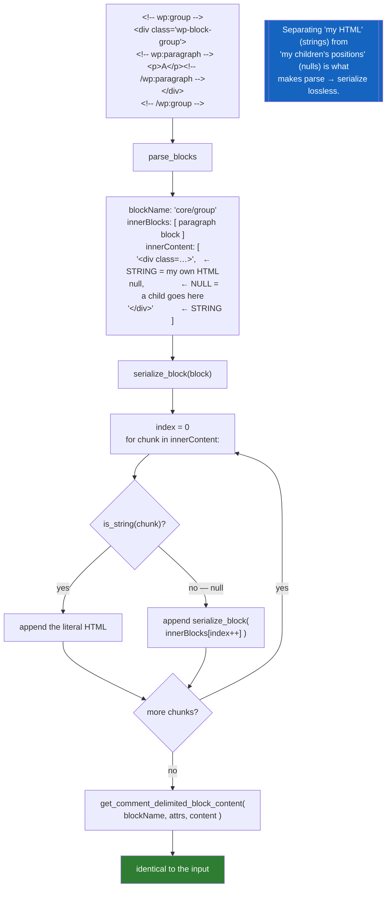
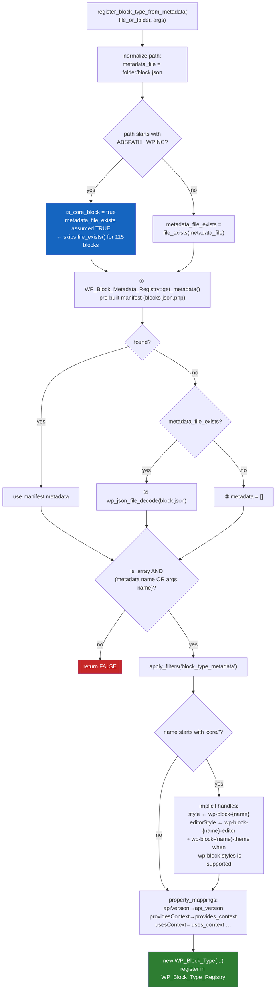
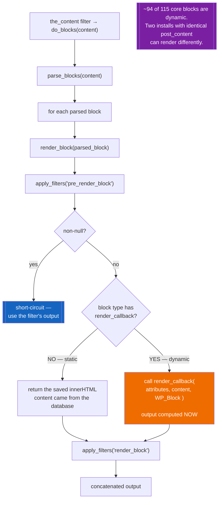

# Flowchart — `block-editor`

> 🟢 CONFIRMED — derived from `wp-includes/class-wp-block-parser.php` and `wp-includes/blocks.php`

## The content format

## Parser stack machine

## Lossless round-tripping via `innerContent`

## Block registration — three metadata sources

## Rendering — static vs dynamic

