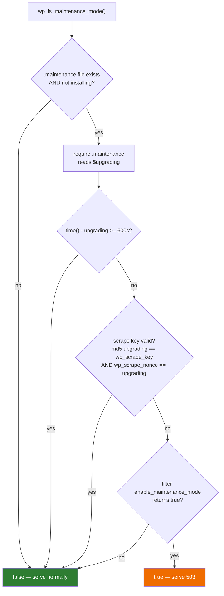
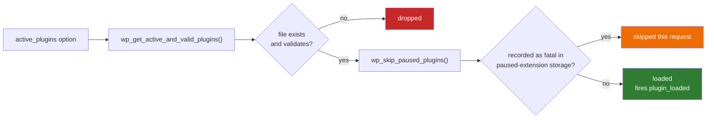

# Flowchart — `bootstrap-and-load`

> 🟢 CONFIRMED — derived from `wp-settings.php` (311 requires) and `wp-includes/load.php`

## Request → initialized runtime

```mermaid
flowchart TD
    A[HTTP request] --> B[index.php<br/>WP_USE_THEMES = true]
    B --> C[wp-blog-header.php]
    C --> D[wp-load.php]

    D --> E{wp-config.php<br/>in ABSPATH?}
    E -->|yes| F[require wp-config.php]
    E -->|no| G{../wp-config.php exists<br/>AND ../wp-settings.php absent?}
    G -->|yes| F
    G -->|no| H[redirect to<br/>wp-admin/setup-config.php]

    F --> I[wp-settings.php]

    I --> J["wp_check_php_mysql_versions()"]
    J -->|PHP &lt; 7.4 or no mysqli| K[["ABORT<br/>plain-text error"]]
    J -->|ok| L[load fatal-error handler<br/>+ recovery-mode services]

    L --> M["wp_initial_constants()"]
    M --> N["wp_register_fatal_error_handler()"]
    N --> O["wp_fix_server_vars()"]
    O --> P{"wp_is_maintenance_mode()"}

    P -->|"true"| Q[["503 maintenance page<br/>exit"]]
    P -->|"false"| R["wp_debug_mode()"]

    R --> S{WP_CACHE?}
    S -->|yes| T[load advanced-cache.php drop-in]
    S -->|no| U
    T --> U["require_wp_db()<br/>wpdb or db.php drop-in"]

    U --> V["wp_set_wpdb_vars()"]
    V --> W["wp_start_object_cache()<br/>or object-cache.php drop-in"]
    W --> X[default-filters.php]
    X --> Y{MULTISITE?}
    Y -->|yes| Z[ms-blogs / ms-settings]
    Y -->|no| AA
    Z --> AA{SHORTINIT?}

    AA -->|"true"| AB[["return false<br/>minimal runtime"]]
    AA -->|"false"| AC[l10n library]

    AC --> AD{"wp_not_installed()"}
    AD -->|no schema| AE[["redirect to install.php"]]
    AD -->|installed| AF[~200 further requires:<br/>capabilities, query, theme,<br/>post, taxonomy, comment,<br/>rewrite, cron, blocks,<br/>block-supports, style-engine,<br/>interactivity-api]

    AF --> AG[load must-use plugins<br/>fires mu_plugin_loaded]
    AG --> AH[load network plugins<br/>multisite only]
    AH --> AI(["do_action muplugins_loaded"])

    AI --> AJ[cookie + SSL constants<br/>vars.php]
    AJ --> AK["create_initial_taxonomies()<br/>create_initial_post_types()"]
    AK --> AL[load active plugins<br/>paused ones skipped<br/>fires plugin_loaded]
    AL --> AM[pluggable.php<br/>plugins may have overridden]
    AM --> AN(["do_action plugins_loaded"])

    AN --> AO["wp_magic_quotes()<br/>rebuilds REQUEST, re-slashes"]
    AO --> AP[create globals:<br/>wp_the_query, wp_query,<br/>wp_rewrite, wp,<br/>wp_widget_factory, wp_roles]
    AP --> AQ(["do_action setup_theme"])

    AQ --> AR[templating constants<br/>load_default_textdomain<br/>wp_locale, locale_switcher]
    AR --> AS[child theme functions.php<br/>then parent theme functions.php]
    AS --> AT(["do_action after_setup_theme"])

    AT --> AU[instantiate WP_Site_Health]
    AU --> AV["GLOBALS wp -&gt; init()<br/>sets up current user"]
    AV --> AW(["do_action init"])
    AW --> AX(["do_action wp_loaded"])

    AX --> AY["wp() → WP::main()"]
    AY --> AZ[template-loader.php]
    AZ --> BA[[rendered response]]

    style K fill:#c62828,color:#fff
    style Q fill:#ef6c00,color:#fff
    style AB fill:#ef6c00,color:#fff
    style AE fill:#ef6c00,color:#fff
    style AI fill:#1565c0,color:#fff
    style AN fill:#1565c0,color:#fff
    style AQ fill:#1565c0,color:#fff
    style AT fill:#1565c0,color:#fff
    style AW fill:#1565c0,color:#fff
    style AX fill:#1565c0,color:#fff
    style BA fill:#2e7d32,color:#fff
```

## Maintenance-mode decision

## Plugin activation gate

