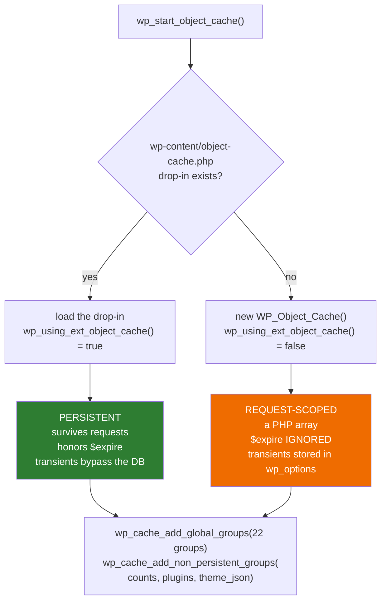
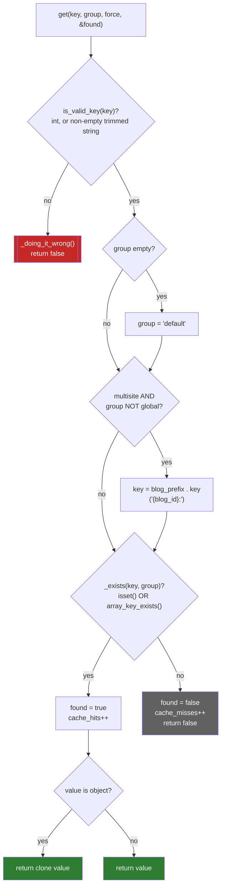
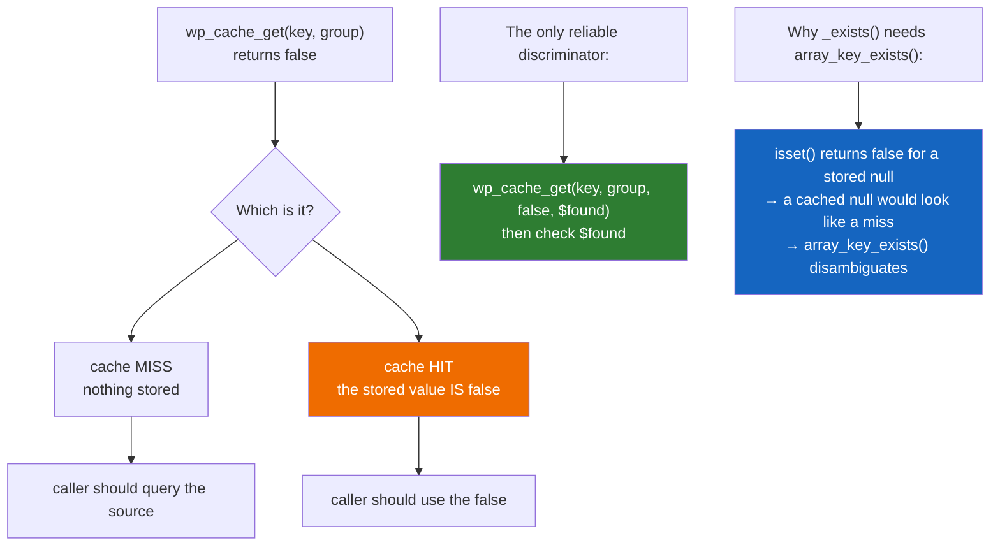
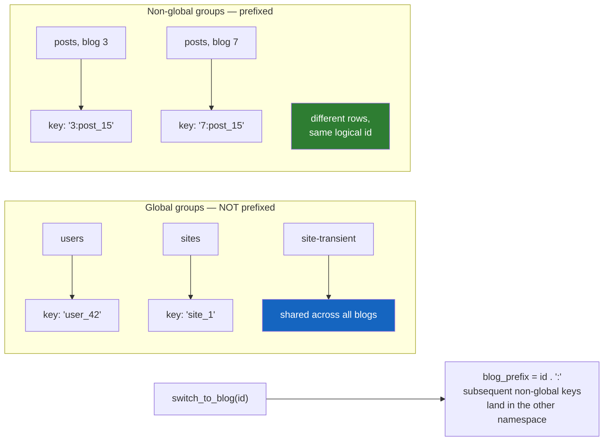

# Flowchart — `cache-and-object-cache`

> 🟢 CONFIRMED — derived from `wp-includes/cache.php` and `wp-includes/class-wp-object-cache.php`

## Backend selection at boot

## `WP_Object_Cache::get()`

## The `false` / `null` ambiguity

## Multisite key isolation

