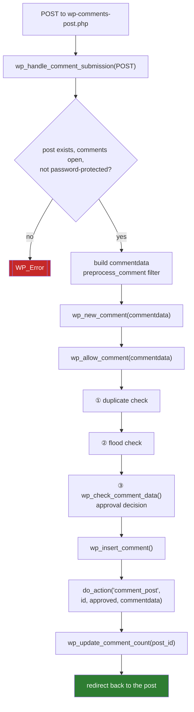
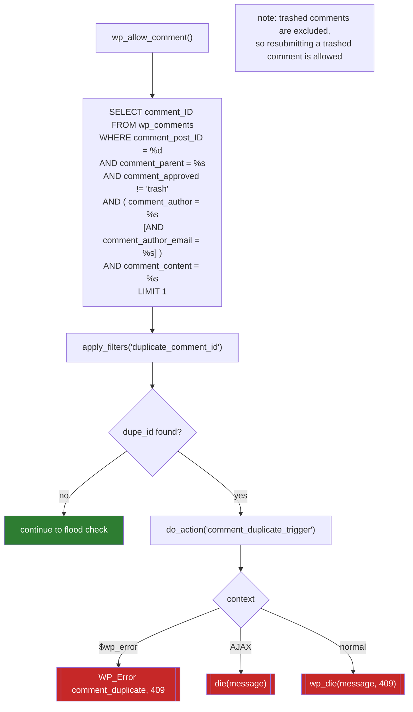
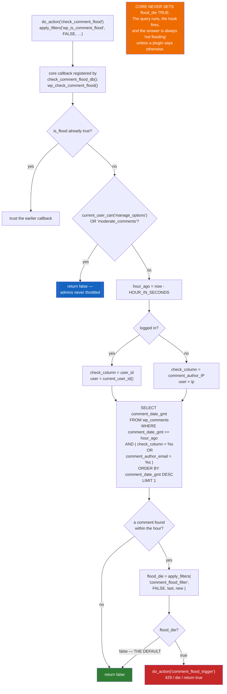
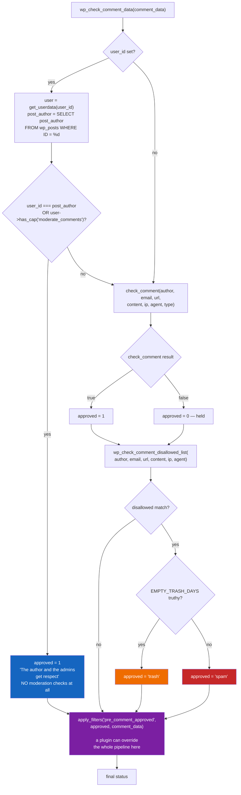
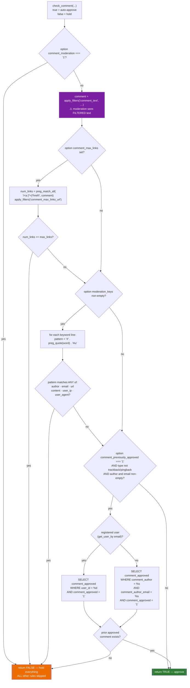

# Flowchart — `comments`

> 🟢 CONFIRMED — derived from `wp-includes/comment.php`

## Submission pipeline

## ① Duplicate detection

## ② Flood control — a hook point, not a rate limit

## ③ Approval decision

## `check_comment()` — the four moderation rules

