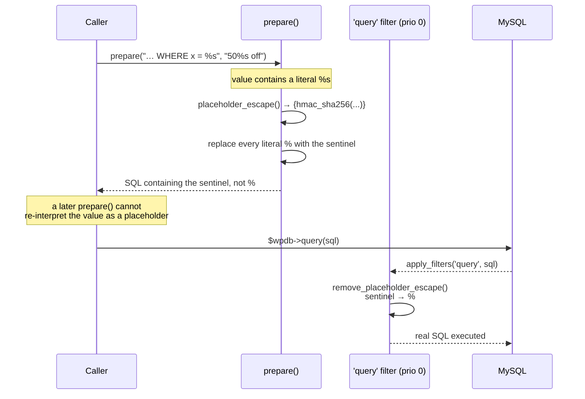
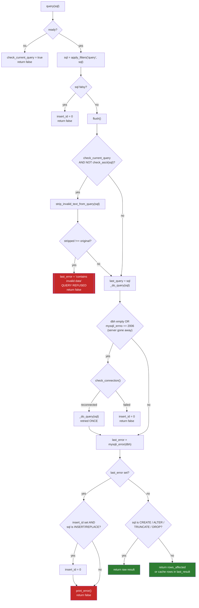
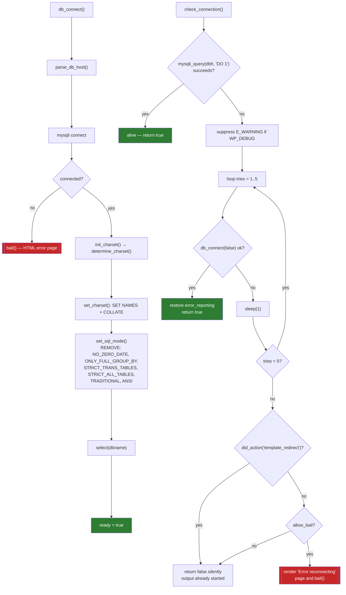
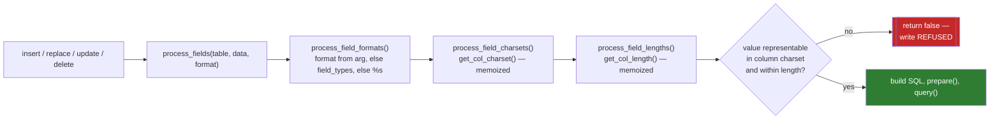

# Flowchart — `database-wpdb`

> 🟢 CONFIRMED — derived from `wp-includes/class-wpdb.php`

## `wpdb::prepare()` — the SQL-injection boundary

```mermaid
flowchart TD
    A["prepare(query, ...args)"] --> B{query is null?}
    B -->|yes| C[return null]
    B -->|no| D{"query contains '%'?"}
    D -->|no| E[early return]
    D -->|yes| F["strip caller quotes:<br/>'%s' → %s, \"%s\" → %s"]

    F --> G["escape unrecognized percents<br/>preg_replace → %%"]
    G --> H["preg_split on placeholder pattern<br/>PREG_SPLIT_DELIM_CAPTURE<br/>stride = 3"]
    H --> I["placeholder_count = (count - 1) / 3"]
    I --> J{"args passed as<br/>single array?"}
    J -->|yes| K[flatten args]
    J -->|no| L
    K --> L[walk placeholders, stride 3]

    L --> M{placeholder type}
    M -->|"%f"| N["rewrite to %F<br/>locale-unaware float"]
    M -->|"%i"| O["rewrite to backtick-%s-backtick<br/>record index in arg_identifiers"]
    M -->|"%s"| P[record index in arg_strings]
    M -->|"%d / %F"| Q[numeric — no quoting]

    N --> R
    O --> R
    P --> R
    Q --> R{"array_intersect(<br/>arg_identifiers, arg_strings)<br/>non-empty?"}

    R -->|yes| S[["re-parse to build conflict list<br/>_doing_it_wrong()<br/>RETURN NULL"]]
    R -->|no| T{"count(args) ==<br/>placeholder_count?"}

    T -->|no| U["_doing_it_wrong()"]
    U --> V{too few args AND<br/>no numbered placeholders?}
    V -->|yes| W[["return '' — empty query<br/>query() will refuse it"]]
    V -->|no| X
    T -->|yes| X[escape values<br/>+ placeholder_escape sentinel]
    X --> Y[interpolate]
    Y --> Z[return prepared SQL]

    style C fill:#616161,color:#fff
    style S fill:#c62828,color:#fff
    style W fill:#ef6c00,color:#fff
    style Z fill:#2e7d32,color:#fff
```

## Placeholder-escape sentinel — second-order injection defense



## `wpdb::query()` — execution gate



## Connection lifecycle and reconnect



## Write path — charset and length validation


