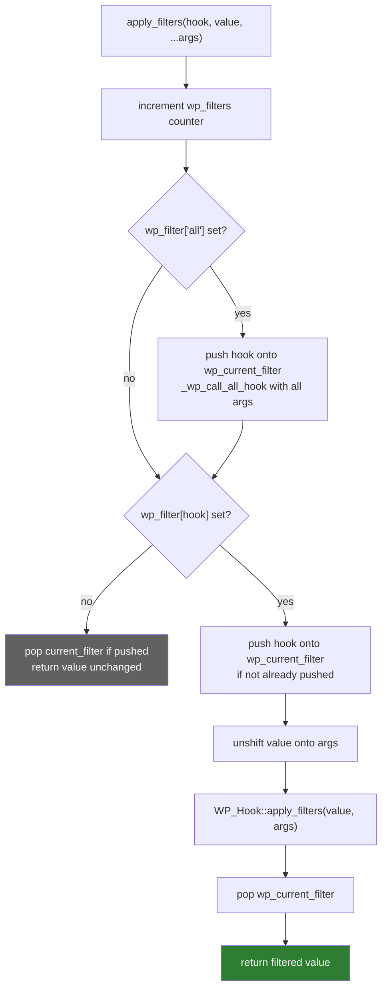
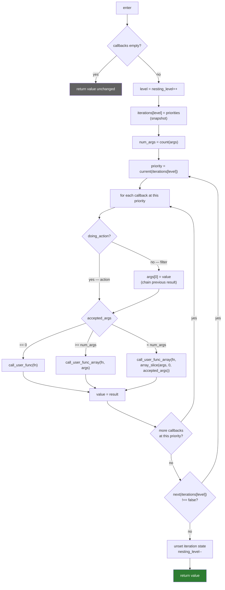
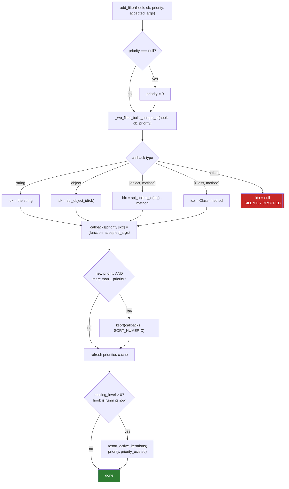
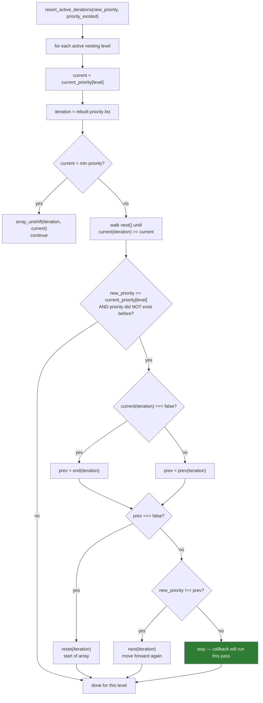
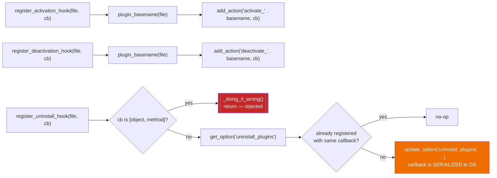

# Flowchart — `hooks-plugin-api`

> 🟢 CONFIRMED — derived from `wp-includes/plugin.php` and `wp-includes/class-wp-hook.php`

## Dispatch: `apply_filters()` / `do_action()`

## `WP_Hook::apply_filters()` — the engine

## Registration and callback identity

## Live re-sort while the hook is executing

## Plugin lifecycle registration

