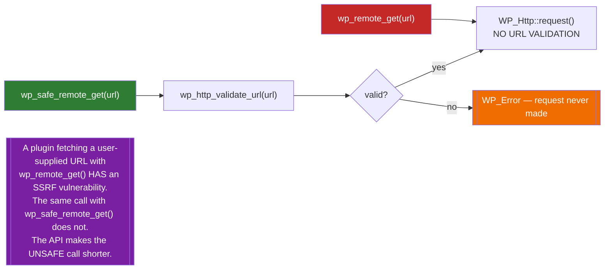
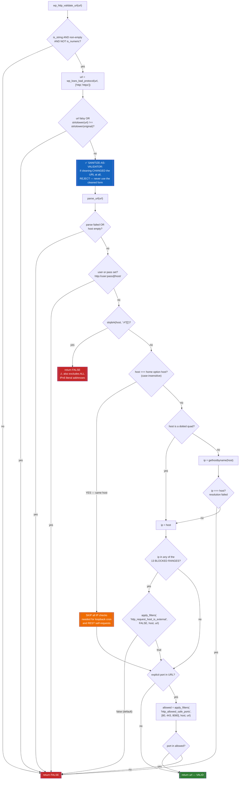
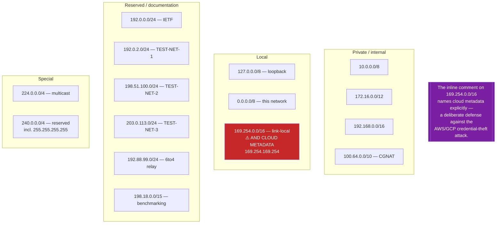
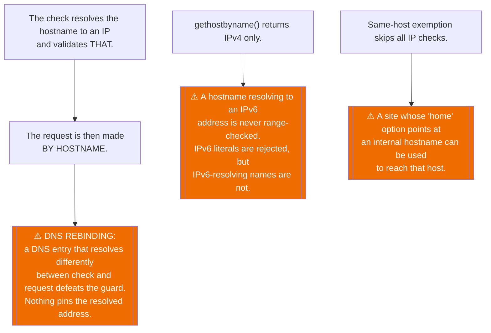

# Flowchart — `http-api`

> 🟢 CONFIRMED — derived from `wp-includes/http.php` and `wp-includes/class-wp-http.php`

## Safe vs unsafe — the whole distinction

## `wp_http_validate_url()` — the SSRF guard

## The 13 blocked IPv4 ranges

## Residual gaps in the guard

