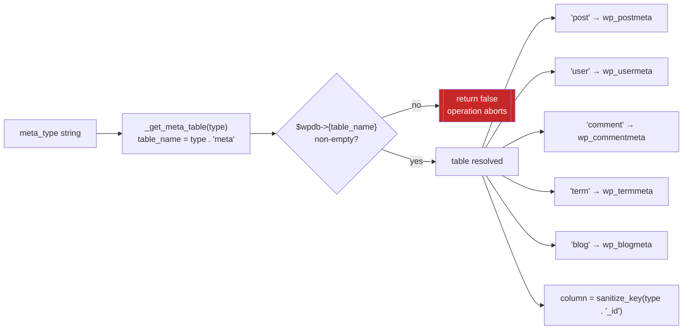
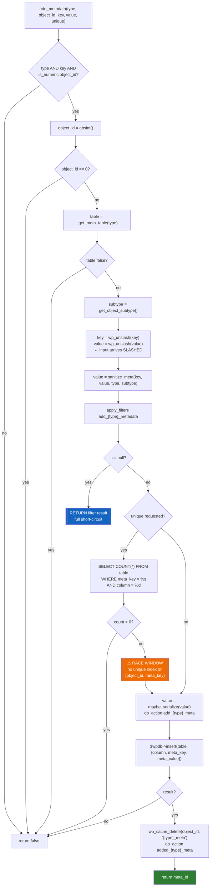
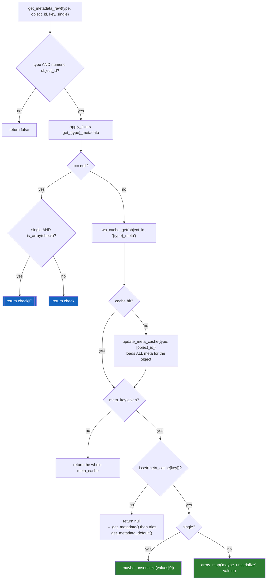
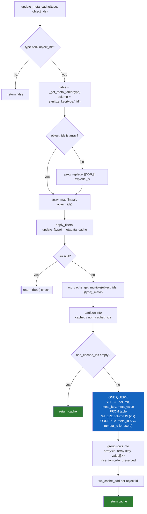
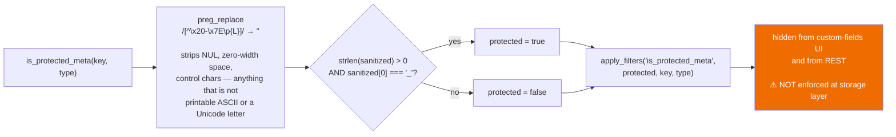

# Flowchart — `metadata`

> 🟢 CONFIRMED — derived from `wp-includes/meta.php`

## Type-to-table dispatch

## `add_metadata()` — including the unique-check race

## `get_metadata_raw()` — read path

## `update_meta_cache()` — the N+1 defense

## Protected-meta determination

