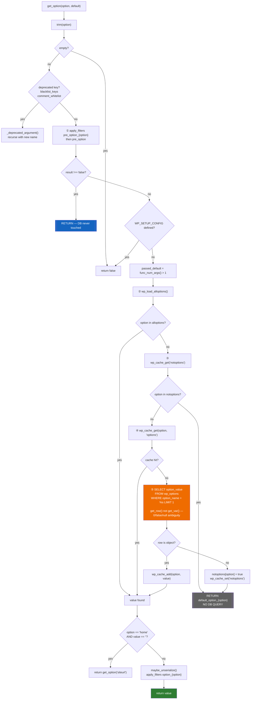
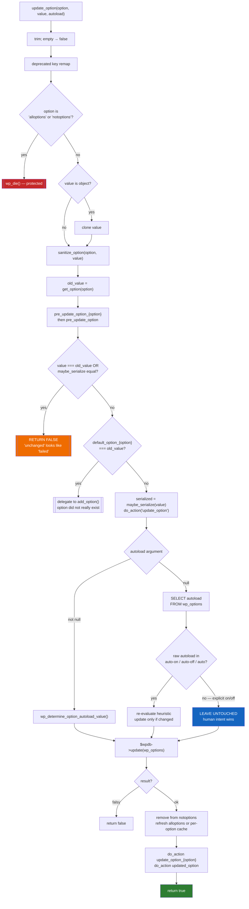
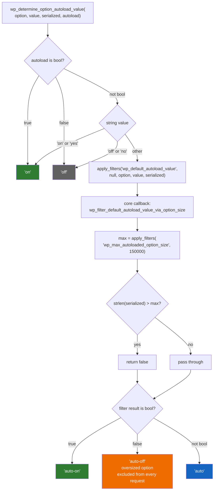
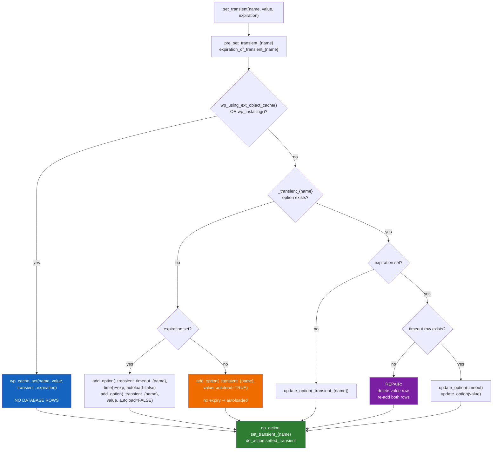
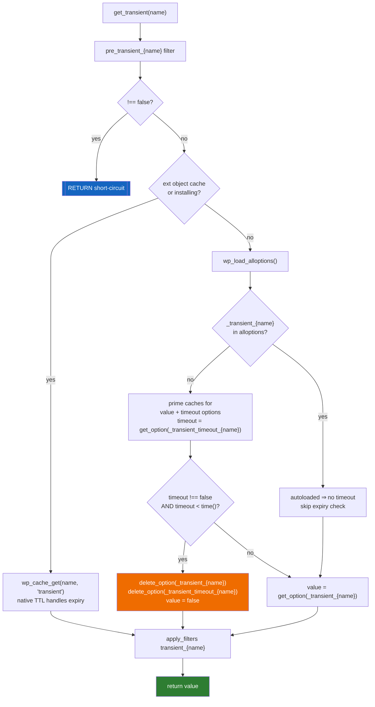

# Flowchart — `options-and-transients`

> 🟢 CONFIRMED — derived from `wp-includes/option.php`

## `get_option()` — five-level read cascade

## `update_option()` — write path

## Autoload value determination

## Transient storage — two backends

## Transient read and lazy expiry

