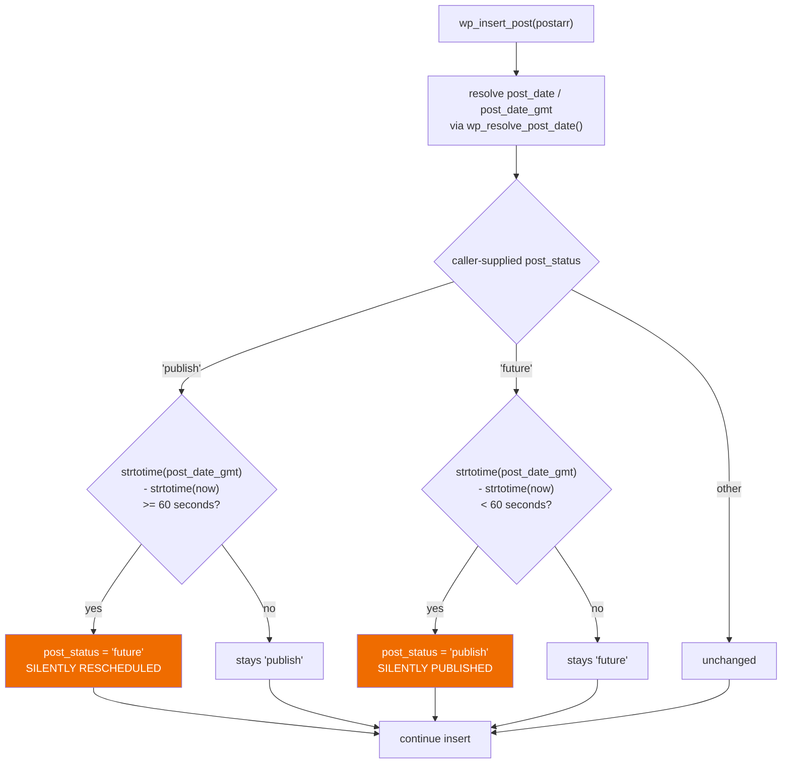
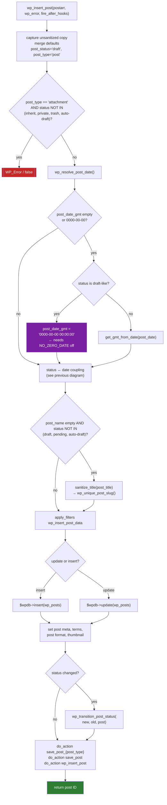
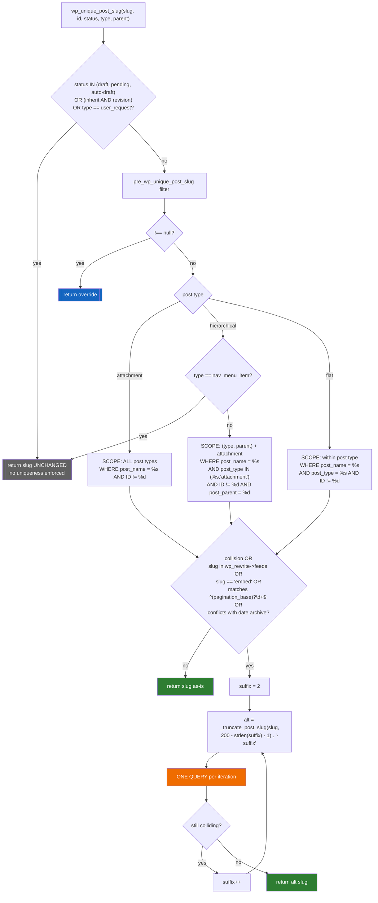
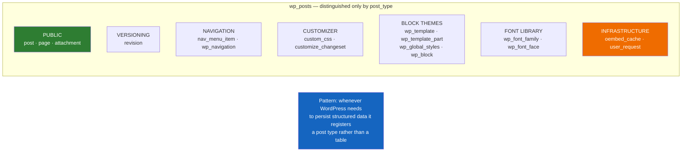

# Flowchart — `posts-and-post-types`

> 🟢 CONFIRMED — derived from `wp-includes/post.php`

## Status derived from date — the core rule



## `wp_insert_post()` — write pipeline



## `wp_unique_post_slug()` — three uniqueness scopes



## Status transition side effects

```mermaid
flowchart TD
    A["wp_transition_post_status(new, old, post)"] --> B["do_action('transition_post_status',<br/>new, old, post)"]
    B --> C["do_action(\"{old}_to_{new}\", post)<br/><br/>11 statuses ⇒ up to 121<br/>undeclared hook names"]

    C --> D["core callback:<br/>_transition_post_status()"]

    D --> E{"old != 'publish'<br/>AND new == 'publish'?"}
    E -->|yes| F{"get_the_guid(post) empty?"}
    F -->|yes| G["UPDATE wp_posts SET guid =<br/>get_permalink(post-&gt;ID)<br/><br/>set once, never updated again"]
    F -->|no| H
    E -->|no| H{"new == 'publish'<br/>OR old == 'publish'?"}

    G --> H
    H -->|yes| I["for timezone in (server, gmt, blog):<br/>delete lastpostmodified:{tz}<br/>delete lastpostdate:{tz}<br/>delete lastpostdate:{tz}:{post_type}"]
    H -->|no| J
    I --> J{"new !== old?"}
    J -->|yes| K["delete post-count caches<br/>('counts' group — non-persistent)"]
    J -->|no| L
    K --> L["ALWAYS:<br/>wp_clear_scheduled_hook(<br/>'publish_future_post', [post-&gt;ID])<br/><br/>'in case the post status<br/>bounced from future to draft'"]
    L --> M{new status still 'future'?}
    M -->|yes| N[re-schedule publish_future_post]
    M -->|no| O[done]

    style C fill:#7b1fa2,color:#fff
    style G fill:#1565c0,color:#fff
    style L fill:#ef6c00,color:#fff
```

## The 16 built-in post types — one table


