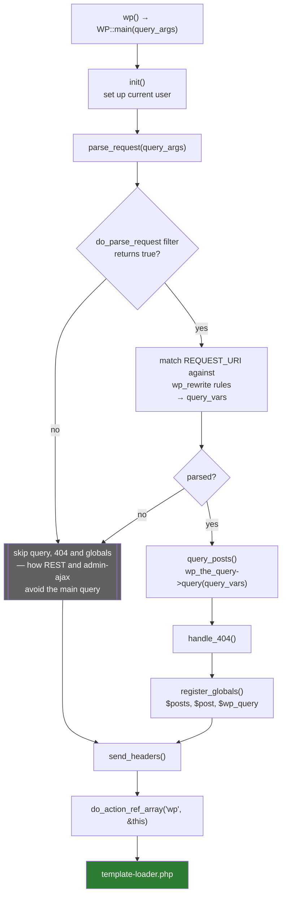
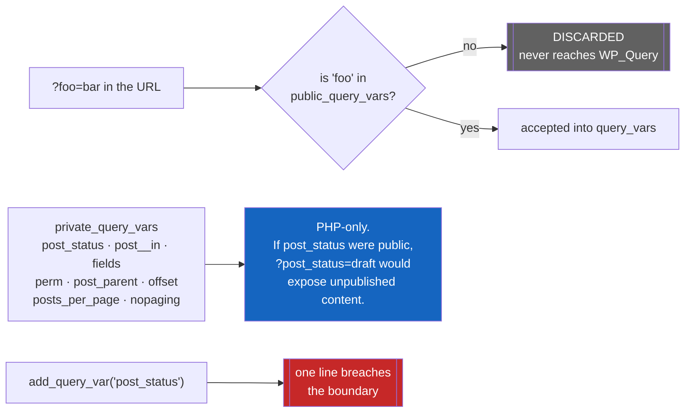
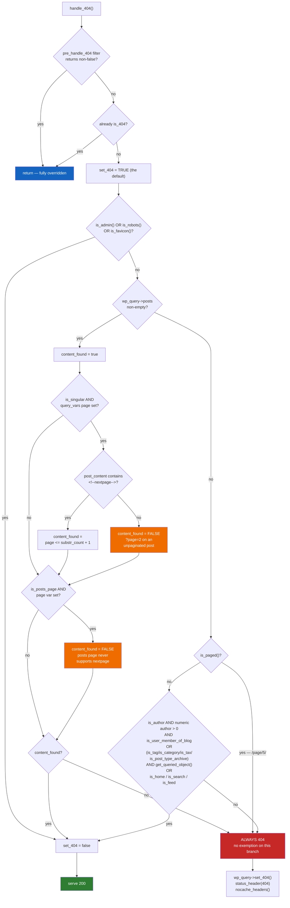
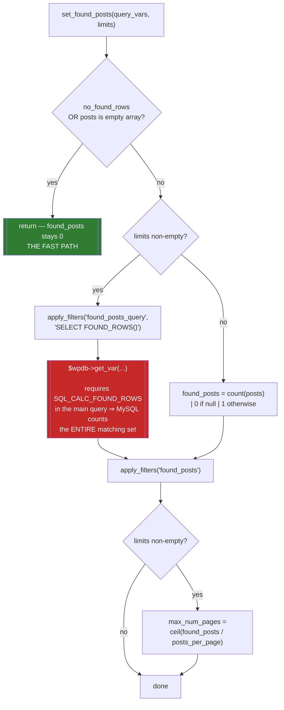
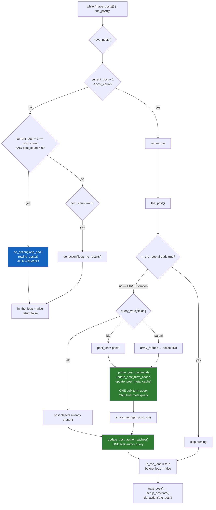

# Flowchart — `query-and-loop`

> 🟢 CONFIRMED — derived from `wp-includes/class-wp.php` and `wp-includes/class-wp-query.php`

## `WP::main()` — the request pipeline

## Query-variable security boundary

## `handle_404()` — exemption cascade

## `WP_Query::get_posts()` — SQL assembly and its 34 filters

```mermaid
flowchart TD
    A["get_posts()"] --> B["parse_query() → query_vars<br/>do_action('pre_get_posts')"]
    B --> C{"posts_pre_query filter<br/>returns non-null?"}
    C -->|yes| D[["BYPASS — use the<br/>filter's posts entirely"]]
    C -->|no| E[build seven clauses]

    E --> F["fields · join · where · groupby<br/>orderby · distinct · limits"]
    F --> G["EARLY filters:<br/>posts_fields, posts_join,<br/>posts_join_paged, posts_where,<br/>posts_where_paged, posts_groupby,<br/>posts_orderby, posts_distinct,<br/>post_limits, posts_clauses"]

    G --> H{"suppress_filters?"}
    H -->|yes| I[skip early set]
    H -->|no| J
    I --> J["LATE filters (*_request):<br/>posts_fields_request, posts_join_request,<br/>posts_where_request, posts_groupby_request,<br/>posts_orderby_request, posts_distinct_request,<br/>post_limits_request, posts_clauses_request"]

    J --> K["old_request = assembled SQL"]
    K --> L["apply_filters('posts_request', sql)"]
    L --> M{"old_request === request<br/>AND fields === 'wp_posts.*'?<br/>(is_unfiltered_query)"}

    M -->|no| N["split disabled —<br/>a plugin changed the SQL"]
    M -->|yes| O{"wp_using_ext_object_cache()<br/>OR (limits AND<br/>posts_per_page &lt; 500)?"}
    O -->|yes| P["split_the_query = true"]
    O -->|no| N

    P --> Q["apply_filters('split_the_query')"]
    Q --> R["SELECT ID FROM …<br/>then hydrate each post<br/>from the object cache"]
    N --> S["SELECT wp_posts.* FROM …<br/>one large result set"]

    R --> T["set_found_posts()"]
    S --> T
    T --> U["apply_filters('posts_results')"]
    U --> V["apply_filters('the_posts')"]
    V --> W[return posts]

    style D fill:#1565c0,color:#fff
    style R fill:#2e7d32,color:#fff
    style S fill:#ef6c00,color:#fff
    style W fill:#2e7d32,color:#fff
```

## Pagination cost — `set_found_posts()`

## The Loop — lazy cache priming

