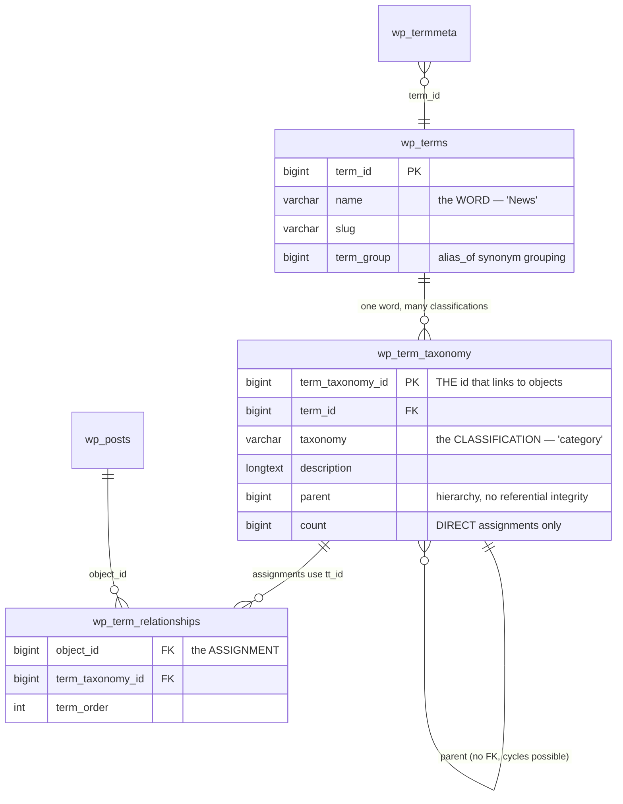
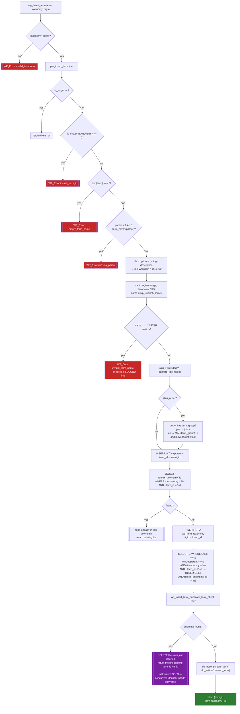
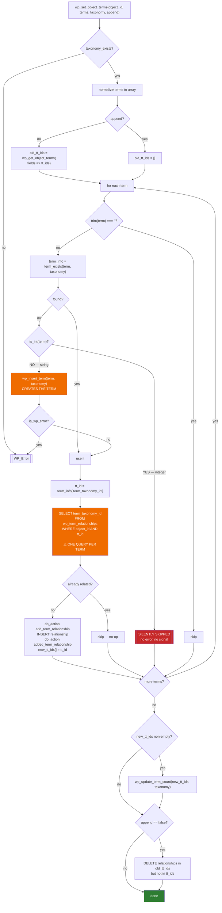
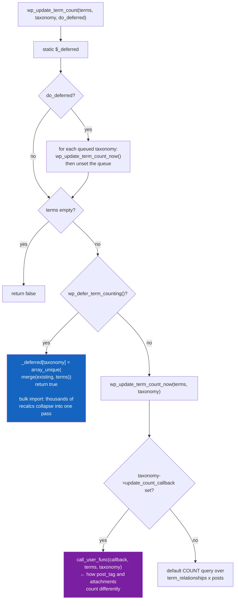
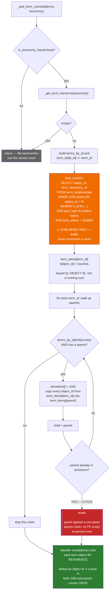

# Flowchart — `taxonomy-and-terms`

> 🟢 CONFIRMED — derived from `wp-includes/taxonomy.php`

## The three-table model

**The trap:** most API functions accept `term_id`, but `wp_term_relationships` stores
`term_taxonomy_id`. One `term_id` used as both a category and a tag has two different `tt_id`s.

## `wp_insert_term()` — insert first, detect duplicate after

## `wp_set_object_terms()` — string creates, integer skips

## Deferred term counting

## `_pad_term_counts()` — hierarchical rollup at read time

