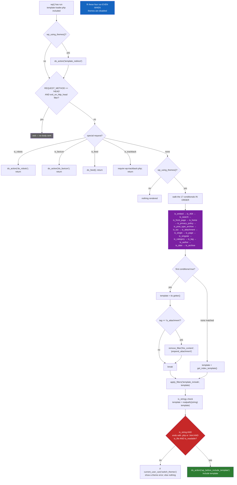
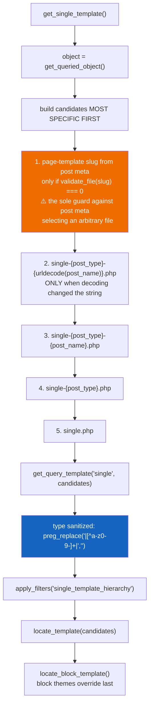
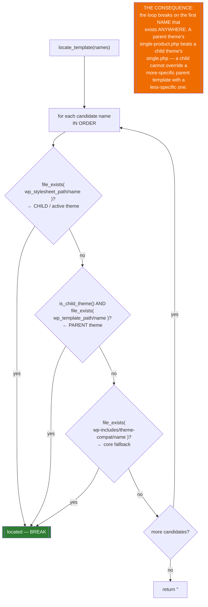
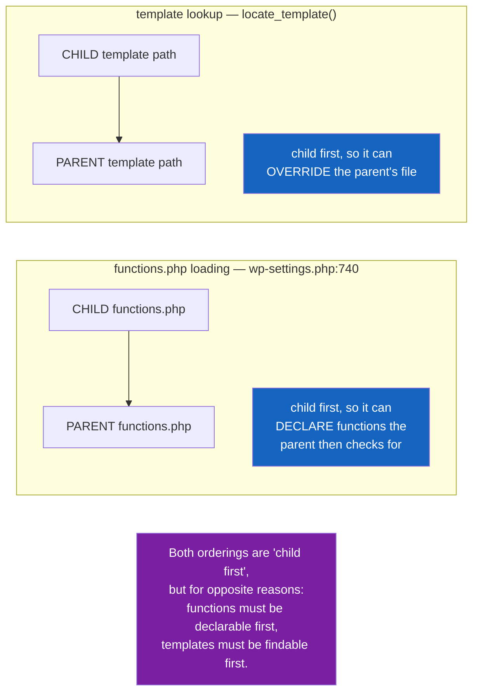

# Flowchart — `themes-and-templates`

> 🟢 CONFIRMED — derived from `wp-includes/template-loader.php` and `wp-includes/template.php`

## `template-loader.php` — the whole hierarchy

## Candidate list → file, for `is_single`

## `locate_template()` — filename specificity beats theme proximity

## Parent/child: two opposite orderings

