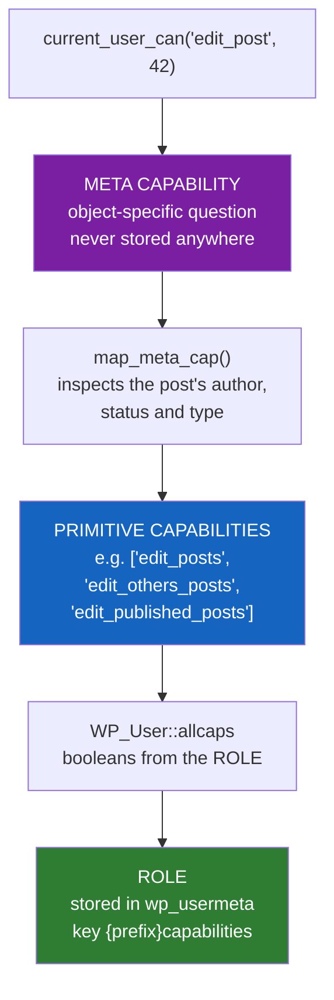
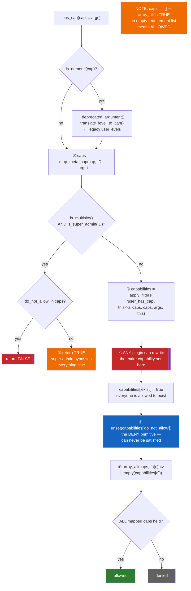
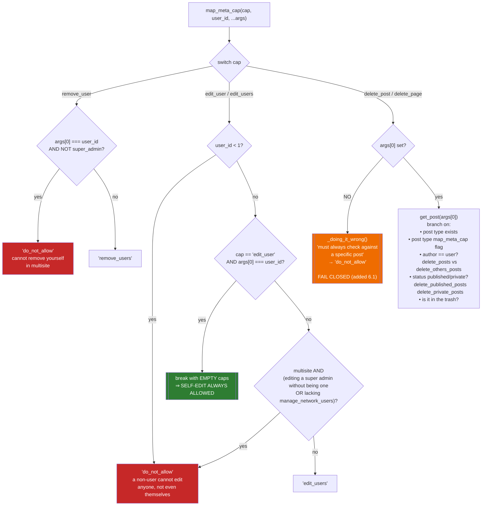
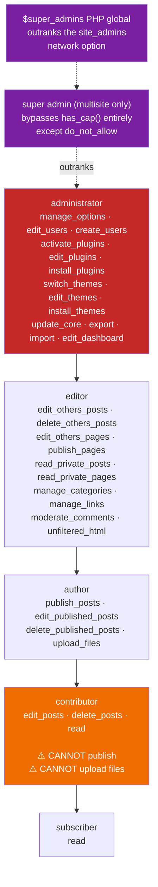
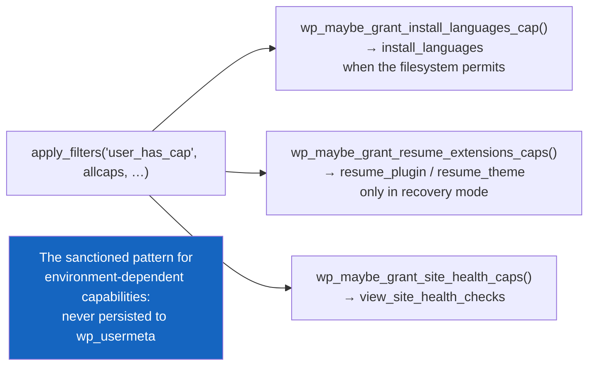

# Flowchart — `users-roles-capabilities`

> 🟢 CONFIRMED — derived from `wp-includes/capabilities.php` and `wp-includes/class-wp-user.php`

## The three-layer authorization model

## `WP_User::has_cap()` — the gate

## `map_meta_cap()` — representative cases

## Role hierarchy

## Dynamic capability grants — compute, don't store

