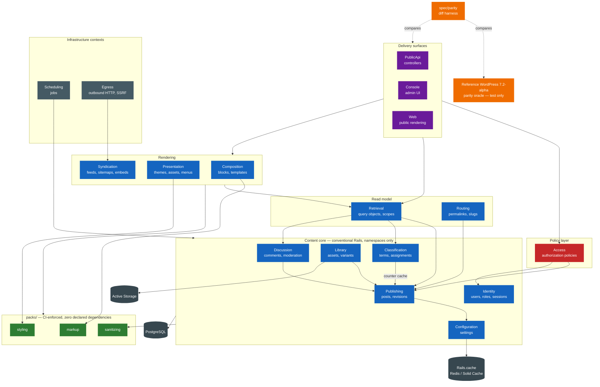

# Target Architecture

> Target architecture of the new system, respecting the paradigm chosen in `paradigm_decision.md`,
> the strategy confirmed in `migration_strategy.md` and the topology approved in
> `topology_decision.md`.
> Required reading before this: `paradigm_decision.md`, then `topology_decision.md`.

## Overview

One Rails 7.1+ application on PostgreSQL, following the Active Record idiom chosen in
`paradigm_decision.md` option 1. The content core lives in a conventional `app/` tree organized into
**12 bounded contexts expressed as Ruby namespaces**, with two thin infrastructure contexts and one
cross-cutting concern added last. Only three boundaries are CI-enforced packages — `markup`,
`sanitizing`, `styling` — per the owner's topology option 3.

There is **no live legacy deployment** (owner ruling), so the system has no runtime boundary with
WordPress at all. Its only tie to the legacy is a **reference WordPress `7.2-alpha-63330` instance
used as a parity oracle**, which is test infrastructure rather than production topology. The hook
system is not reproduced: every behaviour described by the 363 migrated rules becomes final and
non-negotiable at runtime.

## Diagram (Mermaid)



Red = the authorization boundary · Green = CI-enforced packages · Orange = test-only parity
infrastructure.

**Read the arrow directions as the design intent.** Under topology option 3 they are enforced for
the three packs and *detected* for everything else, by the Wave 0 cycle check (RISK-017).

## Components

| Component | Type | Responsibility | Origin |
|---|---|---|---|
| `Web` | API | Public rendering surface — archives, single content, front page | merged: `themes-and-templates` + `query-and-loop` entry paths |
| `PublicApi` | API | HTTP API surface, versioned and policy-gated | `rest-api` (49 controllers) |
| `Console` | API | Administration UI | merged: `admin-application` + `customizer` + `widgets-and-nav-menus` |
| `Access` | Service | Authorization policy objects; the only place capability decisions are made | new — extracted from `map_meta_cap()`'s 870-line switch |
| `Retrieval` | Service | Query objects, scopes, pagination, count strategy | `query-and-loop` (`WP_Query`, 4,900 lines) |
| `Routing` | Service | Permalink structure, slug allocation, redirects for changed slugs | `rewrite-and-permalinks` |
| `Publishing` | Service | Content records, revisions, structured attributes | merged: `posts-and-post-types` + `metadata` |
| `Classification` | Service | Terms, taxonomies, assignments, counts | `taxonomy-and-terms` |
| `Discussion` | Service | Comments, threading, moderation verdicts | `comments` |
| `Library` | Service | Binary assets, derivatives, alt text | `media-and-attachments` |
| `Identity` | Service | Users, role assignments, sessions, credentials, data requests | merged: `users-roles-capabilities` + `authentication-and-sessions` |
| `Configuration` | Service | Named settings with typed values and load policy | `options-and-transients` |
| `Composition` | Service | Block parsing, block rendering, templates, patterns | merged: `block-editor` + `blocks-library` + `block-bindings` + `block-patterns` |
| `Presentation` | Service | Theme resolution, template hierarchy, asset bundles, menus | merged: `themes-and-templates` + `script-modules-and-assets` + `interactivity-api` + `widgets-and-nav-menus` |
| `Syndication` | Service | Feeds, sitemaps, oEmbed provider and consumer | merged: `feeds` + `sitemaps` + `embeds-oembed` |
| `Scheduling` | Worker | Deferred and recurring work | `cron` — becomes Solid Queue / Sidekiq |
| `Platform` | Service | Environment, error recovery, filesystem, schema version, health | merged: `bootstrap-and-load` + `error-handling-and-recovery-mode` + `filesystem-api` + `updates-and-upgrader` + `site-health` + `cache-and-object-cache` |
| `Localization` | Service | Locale resolution, catalogues, plural forms | `internationalization` |
| `Assistance` | Service | AI providers, abilities, connectors | `ai-abilities-connectors` |
| `Egress` | Service | Outbound HTTP with default-on SSRF validation | `http-api` |
| `markup` 📦 | Pack | HTML5 parsing and serialization | `html-api` |
| `sanitizing` 📦 | Pack | Allowlist filtering and text transformation | merged: `kses-security` + `formatting-and-sanitization` |
| `styling` 📦 | Pack | Design-token cascade to CSS | merged: `style-engine` + `global-styles-theme-json` + `block-supports` |
| PostgreSQL | DB | System of record | `database-wpdb` → Active Record |
| `Rails.cache` | DB | Object and fragment cache | `cache-and-object-cache` |
| Active Storage | DB | Binary asset storage and variants | `media-and-attachments` + `filesystem-api` |
| Parity oracle | *(test)* | Reference WordPress instance; the executable definition of the 363 rules | new — the legacy has **no tests at all** (TD-18) |

## Bounded contexts

> **Seventeen contexts, not forty-four** — twelve domain and five supporting. Every grouping below is justified by invariant cohesion,
> transaction boundary or rate of change — never by legacy module membership. Ten legacy modules are
> absorbed by the framework entirely and appear in none of them.

### BC-01: Publishing
- **Responsibility**: content records and their versions — creation, status transitions, structured
  attributes, revision history.
- **Rationale for the grouping / separation**: absorbs `metadata` because metadata is not a domain.
  One legacy code path serves five entity types (F-META-01), which makes it a *mechanism*, not a
  bounded context — attributes belong to whatever owns the record. Separately, this context
  **sheds** most of what `wp_posts` held: nav menu items, global styles, templates, oEmbed cache and
  Customizer changesets leave for contexts whose invariants they actually share (see AD-02).
- **Internal components**: `Publishing::Post` (STI over content types), `Publishing::Revision`,
  `Publishing::Attribute`, `Publishing::StatusTransition`.
- **Depends on**: `Configuration`, `sanitizing` 📦.

### BC-02: Classification
- **Responsibility**: hierarchical and flat classification of content, and the counts derived from it.
- **Rationale**: kept separate from `Publishing` despite the legacy's mutual dependency, because the
  edge is genuinely **one-directional** after the paradigm change: term counts read
  `post_status = 'publish'` (BR-TAX-11), so `Classification` reads `Publishing` and never the
  reverse. Merging them would recreate half the legacy cycle inside one namespace.
- **Internal components**: `Classification::Term`, `Classification::Taxonomy`,
  `Classification::Assignment`.
- **Depends on**: `Publishing` (counter cache only).

### BC-03: Discussion
- **Responsibility**: threaded discussion on content, and the moderation policy that admits it.
- **Rationale**: one of the few legacy modules that already had a real boundary — blast radius 5,
  outside the 23-module component. Kept whole. Moderation lives here rather than in a shared policy
  context because its invariants are about *content admission*, not about *actor permission*: they
  fail with the comment, not with the user.
- **Internal components**: `Discussion::Comment`, `Discussion::Thread`,
  `Discussion::ModerationVerdict`, `Discussion::RateLimit`.
- **Depends on**: `Publishing`, `Identity`, `Configuration`, `sanitizing` 📦.

### BC-04: Library
- **Responsibility**: binary assets, their derivatives and their descriptive attributes.
- **Rationale**: **separated from `Publishing` deliberately**, reversing the legacy's decision to
  make attachments a post type. An asset has no body, no excerpt, no comment status and no
  publication workflow; it has a MIME type, a file path and generated variants — four legacy
  postmeta keys (`_wp_attached_file`, `_wp_attachment_metadata`, `_wp_attachment_image_alt`,
  `_thumbnail_id`) that exist precisely because the shape did not fit. Active Storage owns the
  binaries.
- **Internal components**: `Library::Asset`, `Library::Variant`.
- **Depends on**: `Publishing` (attachment-to-content association only).

### BC-05: Identity
- **Responsibility**: accounts, role assignments, sessions, credentials, and personal-data requests.
- **Rationale**: merges `users-roles-capabilities` with `authentication-and-sessions` because they
  **fail together**: destroying a session token invalidates every outstanding nonce for that user
  (BR-AUTH-15), which is a single invariant spanning both legacy modules. It deliberately excludes
  *authorization*, which leaves for `Access`.
- **Internal components**: `Identity::User`, `Identity::RoleAssignment`, `Identity::Session`,
  `Identity::ApplicationPassword`, `Identity::DataRequest`.
- **Depends on**: `Configuration`.

### BC-06: Access
- **Responsibility**: every authorization decision in the system. The only context permitted to
  answer "may this actor do this?".
- **Rationale for the grouping / separation**: 🔑 **This is the load-bearing extraction of the whole
  design.** In the legacy, `map_meta_cap('edit_post')` reads the post while posts carry
  `post_author` — a mutual dependency that is one of the surviving edges of the 23-module cycle.
  Lifting policy into a context *above* both models converts that cycle into a DAG: `Access` depends
  on `Identity` and `Publishing`; **neither depends on `Access`**. Nothing but a delivery surface may
  reference it. This single edge direction is what the RISK-017 cycle check exists to protect.
- **Internal components**: `Access::PostPolicy`, `Access::CommentPolicy`, `Access::UserPolicy`,
  `Access::TermPolicy`, `Access::AssetPolicy`, `Access::SettingPolicy`, `Access::BasePolicy`.
- **Depends on**: `Identity`, `Publishing`, `Discussion`, `Classification`, `Library`,
  `Configuration`.

### BC-07: Configuration
- **Responsibility**: named settings with typed values and an explicit load policy.
- **Rationale**: preserved as a context but **radically narrowed**. The legacy `options` table is
  the most contended table in WordPress (F-DD-03) because it holds site config *plus* the entire
  compiled routing table *plus* the entire cron queue *plus* the transient cache. Here it holds
  settings only: routing moves to `Routing`, scheduled work to `Scheduling`, and transients to
  `Rails.cache`. Three of the four responsibilities leave.
- **Internal components**: `Configuration::Setting`, `Configuration::LoadPolicy`.
- **Depends on**: nothing in the core.

### BC-08: Retrieval
- **Responsibility**: query objects, scopes, pagination and count strategy across content.
- **Rationale**: kept as its own context rather than dissolved into `Publishing`, because it spans
  three contexts (`Publishing`, `Classification`, `Discussion`) and its invariants are about
  *result-set shape*, not about any one record. This is `WP_Query`'s 4,900-line god-object
  (F-QUERY-07) decomposed into scopes and query objects, and the one place where the pagination-count
  strategy (RISK-013, TD-06) is decided.
- **Internal components**: `Retrieval::PostQuery`, `Retrieval::TermQuery`,
  `Retrieval::CommentQuery`, `Retrieval::Page`.
- **Depends on**: `Publishing`, `Classification`, `Discussion`, `Configuration`.

### BC-09: Routing
- **Responsibility**: permalink structure, slug allocation and uniqueness, redirects for changed
  slugs, request-to-content mapping.
- **Rationale**: separated from `Presentation` and from `Publishing` because it owns a **genuine
  surviving coupling** that must be modelled explicitly rather than inherited: `pagination_base` and
  the registered feed slugs determine which post slugs are legal (BR-POST-07, F-RW-06). Slug
  allocation therefore belongs where the reserved route segments are known — here, not in
  `Publishing`.
- **Internal components**: `Routing::PermalinkStructure`, `Routing::SlugAllocator`,
  `Routing::ReservedSegment`, `Routing::Redirect`.
- **Depends on**: `Publishing`, `Configuration`.

### BC-10: Composition
- **Responsibility**: parsing block markup, rendering blocks to HTML, block patterns and templates as
  content structures.
- **Rationale**: merges four legacy modules that share one lifecycle — a block's definition, its
  parsed form and its rendered output change together. ⚠️ Server-side only: the editor **client**
  ships as build output with no extracted behaviour (TD-19, RISK-010), so this context covers what
  Reversa could actually specify.
- **Internal components**: `Composition::Block`, `Composition::BlockType`, `Composition::Renderer`,
  `Composition::Template`, `Composition::Pattern`.
- **Depends on**: `Publishing`, `markup` 📦, `styling` 📦.

### BC-11: Presentation
- **Responsibility**: theme resolution, template hierarchy, asset bundling, navigation menus.
- **Rationale**: merges `themes-and-templates`, `script-modules-and-assets`, `interactivity-api` and
  the navigation half of `widgets-and-nav-menus`, which collapses **two of the legacy's redundant
  layers at once**: the two complete asset systems with no shared abstraction (TD-12, F-ASSET-04),
  and the menu model that lived entirely in nine `_menu_item_*` postmeta keys (BR-MENU-02).
- **Internal components**: `Presentation::Theme`, `Presentation::TemplateResolver`,
  `Presentation::AssetBundle`, `Presentation::Menu`, `Presentation::MenuItem`.
- **Depends on**: `Composition`, `Retrieval`, `Configuration`, `styling` 📦.

### BC-12: Syndication
- **Responsibility**: machine-readable views of published content — feeds, sitemaps, oEmbed in both
  directions.
- **Rationale**: all three legacy modules are **terminal, with zero dependents** (F-SIM-06) and
  produce the same thing: a serialization of published content for a non-human consumer. Grouping
  them makes Wave 1 a single deliverable.
- **Internal components**: `Syndication::Feed`, `Syndication::Sitemap`, `Syndication::EmbedProvider`,
  `Syndication::EmbedCache`.
- **Depends on**: `Retrieval`, `Egress`, `Configuration`.

### BC-13: Scheduling *(infrastructure)*
- **Responsibility**: deferred and recurring work.
- **Rationale**: thin by design, and listed as infrastructure rather than domain because it holds no
  invariants of its own. The legacy's option-backed queue drained by visitor traffic (F-CRON-01/02,
  TD-09) is already a resolved question: Q7 assumes a real scheduler and Q8 a persistent cache.
- **Internal components**: Active Job classes, a recurring schedule definition.
- **Depends on**: whatever it schedules.

### BC-14: Egress *(infrastructure)*
- **Responsibility**: all outbound HTTP, with SSRF validation applied **by default**.
- **Rationale**: separated as its own context specifically to make deviation `BR-HTTP-01`
  structural. In the legacy, SSRF validation is opt-in by function name — `wp_safe_remote_get()`
  validates, `wp_remote_get()` does not (F-HTTP-05). Here there is one door, it validates, and the
  unsafe path is an explicit named escape hatch.
- **Internal components**: `Egress::Client`, `Egress::UrlPolicy`, `Egress::UnsafeClient`.
- **Depends on**: `Configuration`.

### BC-15: Platform *(supporting)*
- **Responsibility**: environment detection, error handling and recovery, filesystem access, schema
  versioning and upgrades, health checks, and the object-cache configuration.
- **Rationale for the grouping**: six legacy modules collapse here — `bootstrap-and-load`,
  `error-handling-and-recovery-mode`, `filesystem-api`, `updates-and-upgrader`, `site-health`,
  `cache-and-object-cache` — carrying **47 migrated rules** between them. They are grouped because
  none holds a *domain* invariant: each describes how the runtime behaves when something is missing,
  broken or being replaced. Supporting contexts can be coarser than domain ones for exactly this
  reason, and splitting them would produce five namespaces of two files each.
- ⚠️ **The honest caveat.** Rails absorbs most of this outright — it owns boot, error handling,
  migrations, file handling and deployment. Several of these 47 rules therefore describe a mechanism
  the target does not have (`.maintenance` file timestamps, `dbDelta()` schema diffing, Ed25519
  verification of downloaded update packages). The Curator classified them MIGRATE and this Designer
  does **not** reclassify them — but the Inspector must decide, rule by rule, which are *behaviour to
  preserve* and which are *mechanism the framework replaced*, and record the latter as deviations
  rather than writing parity tests that cannot pass. Flagged in `ambiguity_log.md`.
- **Internal components**: `Platform::Environment`, `Platform::RecoveryMode`, `Platform::Health`,
  `Platform::SchemaVersion`, `Platform::Storage`.
- **Depends on**: `Configuration`.

### BC-16: Localization *(supporting)*
- **Responsibility**: locale resolution, translation catalogues, plural forms, per-user locale.
- **Rationale**: kept out of `Platform` because it does hold real invariants — locale fallback
  order, plural-form selection, and per-user locale overriding site locale (BR-I18N-04) are rules
  that can be wrong, not merely configuration. Rails `I18n` supplies the machinery; the rules
  describe the resolution order it must follow.
- **Internal components**: `Localization::Locale`, `Localization::Catalogue`.
- **Depends on**: `Identity` (per-user locale), `Configuration`.

### BC-17: Assistance *(supporting)*
- **Responsibility**: AI provider abstraction, declared abilities, connector registry.
- **Rationale**: a terminal legacy module with **zero dependents**, and the newest subsystem in the
  tree — `php-ai-client/` is 146 vendored files (`dependencies.md` §3). It is kept whole and
  sequenced into Wave 5 because nothing depends on it and it has no coupling to the content core.
  ⚠️ Its Ruby counterpart is a genuine reimplementation, not a port: no equivalent vendored library
  exists (RISK-015).
- **Internal components**: `Assistance::Provider`, `Assistance::Ability`, `Assistance::Connector`.
- **Depends on**: `Egress`, `Configuration`.

### Cross-cutting: Tenancy *(Wave 5, post-launch)*
Not a bounded context — a schema-level concern. `BR-MS-01` puts one PostgreSQL schema per site,
switched via `search_path`. Introduced **last**, deliberately: it changes connection handling for
every context above (RISK-009), and adding it to a stable system is a smaller job than threading it
through an unstable one.

## Architectural decisions (condensed ADR style)

### AD-01: The hook system is not reproduced, so behaviour is final
- **Decision**: no runtime extension registry. No filters, no actions, no priorities, no callback
  registration. Behaviour is expressed directly in models, services and policies.
- **Rejected alternatives**: an explicit extension-point registry limited to block rendering and
  template resolution (option 3 of `paradigm_decision.md`); a full hook registry port (option 2).
- **Rationale**: the owner chose option 1, and `migration_brief.md` records no compatibility burden.
  The consequence is the property that makes this project checkable at all: **every one of the 363
  rules describes WordPress's unfiltered default, and in the target that default is the permanent,
  only behaviour.** Nothing can change it at runtime, so a parity test that passes stays passing.
- **Traceability**: `paradigm_decision.md` implication 2; `discard_log.md`, 15 hook rules discarded.

### AD-02: `post_type` encoded two different things; only one of them is inheritance
- **Decision**: **STI for content types, separate tables for machinery.** `Publishing::Post` is a
  single-table hierarchy over the genuinely content-shaped types (post, page and future custom
  content types). The other eleven built-in types leave `wp_posts` for tables of their own:
  attachments → `Library::Asset`; revisions → `Publishing::Revision`; nav menu items →
  `Presentation::MenuItem`; templates, template parts and patterns → `Composition`; global styles and
  font faces → `styling` 📦 data; Customizer changesets → `Console`; oEmbed cache →
  `Syndication::EmbedCache`; personal-data requests → `Identity::DataRequest`.
- **Rejected alternatives**: **(a)** one STI table for all 16 types — closest to the legacy, keeps
  the two composite indexes intact, but perpetuates a 23-column table in which a font face carries
  `comment_status` and `ping_status`; **(b)** sixteen separate models with no inheritance — cleanest
  in isolation, but comments, term assignments and attributes all point at `object_id`, so splitting
  the target of those associations turns three clean foreign keys into three polymorphic ones. That
  is a worse outcome than the problem it solves.
- **Rationale**: the legacy `post_type` column is doing two unrelated jobs. For post and page it is a
  **content subtype** — same shape, same lifecycle, same queries, which is exactly what STI models
  well. For the other eleven it is **storage tenancy**: unrelated things sharing a table because
  WordPress had one flexible table and no migrations. ADR-004 records "everything is a post" as
  deliberate, and it was — under a constraint (install by unzipping, no schema tooling) that
  `migration_brief.md` has deleted. The split keeps `type_status_date` and `type_status_author`
  meaningful for the rows they were tuned for (F-DD-04), and it deletes the largest single source of
  query noise: revisions and menu items no longer have to be excluded from every content query.
- **Traceability**: F-POST-01, F-POST-07, ADR-004, `paradigm_decision.md` implication 5, RISK-003.

### AD-03: Core-owned metadata becomes columns; only genuinely arbitrary metadata stays key-value
- **Decision**: every postmeta key that core itself owns is promoted to a real column, association or
  table. `_thumbnail_id` → a foreign key to `Library::Asset`. `_wp_page_template` → a column. The
  nine `_menu_item_*` keys → columns on `Presentation::MenuItem`. `_wp_old_slug` / `_wp_old_date` →
  `Routing::Redirect` rows. `_wp_trash_meta_status` / `_wp_trash_meta_time` → `trashed_at` and
  `status_before_trash` columns. `_edit_lock` / `_edit_last` → an edit-lock table. Remaining
  user-defined attributes live in a `jsonb` column with a GIN index.
- **Rejected alternatives**: reproducing the meta tables verbatim, which is the literal port;
  jsonb for everything, which loses referential integrity for `_thumbnail_id` and menu structure.
- **Rationale**: `meta_value` is unindexed in all six legacy meta tables and is the dominant
  slow-query source (F-DD-02, F-META-03, TD-07). More importantly, the `_menu_item_orphaned`
  tombstone mechanism (BR-MENU-05) exists **only** because there are no foreign keys (F-DD-01) — a
  real FK deletes both the orphan problem and the tombstone that works around it.
- **Traceability**: F-DD-01, F-DD-02, F-META-01/02/03, BR-MENU-02/05, TD-07.

### AD-04: Authorization is a context, and its permissive defaults are reachable only by declaration
- **Decision**: `Access` is the only context that decides permissions. Per the owner's override, the
  legacy's permissive defaults are **reproduced**: a policy emitting no capabilities allows
  (`BR-CAP-05`), a route with no policy is public (`BR-REST-05`), an ungated endpoint class exists
  (`BR-ADM-07`). A static check fails the build when a route, policy or endpoint is registered
  without an explicit authorization declaration — **including a declaration of `public`**.
- **Rejected alternatives**: fail-closed defaults, which question Q4 chose and the owner then
  overrode and reaffirmed. Not relitigated here.
- **Rationale**: the ruling makes permissiveness the *specification*, and AD-01 makes it permanent.
  The check does not change the runtime default — it removes the way that default gets reached, which
  is by someone forgetting. Under AD-01 there is no filter to correct it afterwards.
- **Traceability**: owner override 1 in `target_business_rules.md`; F-DOM-02, DR-10, TD-01; RISK-004.

### AD-05: Compensating transactions become database constraints
- **Decision**: every legacy check-then-act loop is replaced by a unique index plus a transaction.
  `(taxonomy, parent, slug)` unique; `(type, slug)` unique for content; `(post_id, key)` unique where
  the legacy passed `$unique`. Foreign keys on all 18 relationships that currently have none.
- **Rejected alternatives**: porting the loops, which reproduces three rules that the constraint
  makes vacuous.
- **Rationale**: `wpdb` exposes no transactions (F-DB-06), so **every uniqueness guarantee in
  WordPress is advisory** (F-DOM-04). `wp_insert_term()` inserts rows, queries for an older duplicate
  and then deletes its own rows (F-TAX-02); `add_metadata()` runs `SELECT COUNT(*)` then `INSERT`
  with no unique index behind it (F-META-02). Each collapses to one constraint.
- **Traceability**: `paradigm_decision.md` implication 3; F-DB-06, F-DOM-04, F-TAX-02, F-META-02,
  TD-05; `discard_log.md`.

### AD-06: Three of `options`' four responsibilities leave
- **Decision**: `Configuration` holds settings only. The compiled routing table moves to `Routing` as
  derived, cached state; the scheduled-event queue moves to `Scheduling` as a real job store;
  transients move to `Rails.cache`.
- **Rejected alternatives**: one settings table holding all four, as the legacy does.
- **Rationale**: the 150 KB autoload threshold can silently de-autoload the routing table or the cron
  queue (BR-OPT-06, F-RW-02, F-CRON-03) — a failure mode that exists *only* because unrelated things
  share a table with a size heuristic. Separating them deletes the coupling, not just the symptom.
- **Traceability**: F-DD-03, F-DD-09, BR-OPT-06, F-RW-02/03, F-CRON-03, TD-11.

### AD-07: One UTC timestamp per event, not a local/GMT pair
- **Decision**: `timestamptz` in UTC, one column per event. The legacy's paired `post_date` /
  `post_date_gmt`, `comment_date` / `comment_date_gmt`, `post_modified` / `post_modified_gmt` collapse
  to one each, with the site timezone as a `Configuration` setting applied at render.
- **Rejected alternatives**: keeping both columns, which preserves a MySQL limitation that
  PostgreSQL does not have.
- **Rationale**: the pairs exist because MySQL `datetime` is timezone-naive. `BR-POST-01`'s
  60-second publish threshold compares the GMT column to current GMT and works identically against a
  single `timestamptz`. ⚠️ `0000-00-00 00:00:00` becomes `NULL`, with `NULLS LAST` stated explicitly
  wherever ordering matters — MySQL and PostgreSQL disagree on the default.
- **Traceability**: BR-POST-04, BR-DB-10, ADR-007, RISK-007.

### AD-08: The parity oracle is architecture, not tooling
- **Decision**: a reference WordPress `7.2-alpha-63330` instance and a response-diff harness
  (`spec/parity/`) are first-class components of this system, built in Wave 0 and retired only after
  Wave 5.
- **Rejected alternatives**: hand-written tests derived from the rule statements, which would test
  the Designer's reading of the legacy rather than the legacy.
- **Rationale**: the legacy tree contains **zero tests** (TD-18) and all 431 rules were verified by
  reading, never by executing. With no live deployment, the oracle is the only WordPress in the
  project and the only executable definition of the 363 rules. RISK-001 is the project's single
  point of failure and this component is its entire mitigation.
- **Traceability**: TD-18, `inventory.md` §1, RISK-001, `migration_strategy.md` Strategy C.

## Fidelity to the chosen paradigm

- **Target paradigm**: classic OO / Active Record (Rails), from `paradigm_decision.md` option 1,
  `derived_appetite: transformational`.

- **How the architecture honors that paradigm** — the six implications, discharged one by one:

  | Implication | How this architecture materializes it |
  |---|---|
  | **1 — global mutable state has no Rails analogue** | No process-wide singletons anywhere. `switch_to_blog()`'s global mutation is replaced by `search_path` switching in the Tenancy concern, with `search_path` reset on connection **checkout** and every background job carrying an explicit tenant identifier rather than inheriting ambient state. Per-request context uses `ActiveSupport::CurrentAttributes`, never a global. |
  | **2 — the hook system disappears, so the documented default becomes final** | AD-01. No extension registry exists. The Inspector's parity specs assert the unfiltered default because it is now the only behaviour. |
  | **3 — every compensating transaction can be deleted** | AD-05. Unique indexes plus real transactions; the check-then-act loops are discarded with their invariants named in `discard_log.md`. |
  | **4 — derived state moves from inline procedure into the model** | Post status becomes an explicit state transition on `Publishing::Post` with `BR-POST-01`'s 60-second threshold as a named model rule, not a date-comparison side effect. Term counts become a **counter cache** on `Classification::Term` instead of `_pad_term_counts()` joining to `posts` on every render. Comment counts likewise. |
  | **5 — sixteen post types force an explicit modelling fork** | AD-02, resolved: STI for content, separate tables for machinery, with both rejected alternatives argued. |
  | **6 — the slashing convention vanishes** | Nothing in this architecture slashes or unslashes. `sanitizing` 📦 receives raw Rails params. ⚠️ Every rule that assumed slashed input is re-read before porting (RISK-008), and the oracle corpus carries quote- and backslash-heavy content so the harness catches what review misses. |

- **Active Record checklist** (`references/paradigm-checklist.md`, OO section, adapted — the target
  is Active Record, so *"Active Record explicitly forbidden"* does not apply and its inverse does):
  - ✅ Models own their invariants; validations and DB constraints replace check-then-act loops.
  - ✅ Persistence is inherited, not injected — no repository layer, no DI container. This is
    deliberate: `paradigm_decision.md` weighed and rejected Hanami/dry-rb.
  - ✅ Policy objects hold authorization; models do not.
  - ✅ Every element below traces to a legacy origin or to `discard_log.md`.
  - ✅ Contexts justified by cohesion, not by the legacy structure.
  - n/a — event-driven, functional and actor sections: the target paradigm is none of these, so no
    domain events, outbox or DLQ are specified. `target_domain_model.md` records state transitions as
    model behaviour rather than as published events.

## Fidelity to the chosen topology

- **Chosen topology**: **option 3 — hybrid.** Conventional Rails for the content core; `packs/` for
  the three leaf libraries only.

- **How the tree materializes it**:

```
app/
  models/
    publishing/      post.rb  revision.rb  attribute.rb  status_transition.rb
    classification/  term.rb  taxonomy.rb  assignment.rb
    discussion/      comment.rb  thread.rb  moderation_verdict.rb  rate_limit.rb
    library/         asset.rb  variant.rb
    identity/        user.rb  role_assignment.rb  session.rb  application_password.rb
                     data_request.rb
    configuration/   setting.rb  load_policy.rb
    access/          base_policy.rb  post_policy.rb  comment_policy.rb  user_policy.rb
                     term_policy.rb  asset_policy.rb  setting_policy.rb
    retrieval/       post_query.rb  term_query.rb  comment_query.rb  page.rb
    routing/         permalink_structure.rb  slug_allocator.rb  reserved_segment.rb
                     redirect.rb
    composition/     block.rb  block_type.rb  renderer.rb  template.rb  pattern.rb
    presentation/    theme.rb  template_resolver.rb  asset_bundle.rb  menu.rb  menu_item.rb
    syndication/     feed.rb  sitemap.rb  embed_provider.rb  embed_cache.rb
    platform/        environment.rb  recovery_mode.rb  health.rb  schema_version.rb
                     storage.rb
    localization/    locale.rb  catalogue.rb
    assistance/      provider.rb  ability.rb  connector.rb
  controllers/
    public_api/      the HTTP API surface
    console/         administration UI
    web/             public rendering
  jobs/              Scheduling
  services/
    egress/          client.rb  url_policy.rb  unsafe_client.rb

packs/                                          ← the ONLY CI-enforced boundaries
  markup/       package.yml (0 deps)  app/  spec/     ← html-api
  sanitizing/   package.yml (0 deps)  app/  spec/     ← kses + formatting
  styling/      package.yml (0 deps)  app/  spec/     ← style-engine + global-styles

spec/
  parity/       harness/  corpus/  features/          ← AD-08, no legacy origin

bin/
  check_cycles                                        ← RISK-017 mitigation, Wave 0
```

- **What is enforced and what is not** — stated precisely, because the distinction is the whole
  content of option 3:
  - **Enforced by CI**: the three packs declare **zero** dependencies. A pack referencing anything in
    `app/` fails the build. This preserves the one structural property the legacy got right
    (F-SIM-03).
  - **Detected by CI, not prevented**: the namespace graph in `app/models/`. `bin/check_cycles`
    parses cross-namespace constant references, builds the directed graph and fails if it is not
    acyclic. It ships in Wave 0 — added later it is worth almost nothing, because the graph it exists
    to keep acyclic already will not be.
  - **Convention only**: the specific arrow directions in the diagram above. `Classification` →
    `Publishing` and not the reverse is a design intent that review upholds; only the *cycle* is
    machine-checked.

> ⚠️ **Amended 2026-08-22 by owner ruling.** The direction between `Publishing` and
> `Library` below is **reversed**: it is `Publishing → Library`, not `Library → Publishing`.
>
> `bin/check_cycles` surfaced a conflict between this document and `target_data_model.md`
> on its first run against real models. The data model specifies foreign keys in **both**
> directions — `posts.featured_asset_id → assets.id` (AD-03's promoted `_thumbnail_id`) and
> `assets.attached_to_id → posts.id` (the legacy attachment's `post_parent`) — which no
> arrangement of code can make acyclic.
>
> The ruling keeps AD-03's FK and demotes `assets.attached_to_id` to a plain column
> (`db/migrate/20260822000060`): for an attachment, `post_parent` records only "uploaded
> while editing this post", which is provenance rather than structure. `Library` therefore
> depends on `Identity` alone, and the graph is acyclic with **no acknowledged
> exceptions**.

- **The intended dependency graph is acyclic.** Reading the diagram: packs depend on nothing;
  `Configuration` depends on nothing in the core; `Publishing` → `Configuration`; `Classification`,
  `Discussion`, `Library`, `Routing` → `Publishing`; `Retrieval` → the content contexts;
  `Composition`, `Presentation`, `Syndication` → `Retrieval`; `Platform`, `Localization` and
  `Assistance` sit at the edge, depending on `Configuration` (and `Identity`, `Egress`) but with
  nothing in the core depending on them; `Access` → everything it guards, with
  **nothing depending on `Access`** except delivery surfaces; surfaces → `Access` and `Retrieval`.
  No back-edge exists. ⚠️ Under option 3 this is a **design intent enforced by detection**, not a
  guarantee provided by the topology — the honest statement, per `topology_decision.md`.

## Boundaries with the legacy system during the migration

**There is no runtime boundary.** The owner confirmed no live deployment, so there is no proxy, no
CDC pipeline, no dual-stack period and no shared database. The waves in `migration_strategy.md` are
internal delivery milestones gated by parity, not routing changes.

The only boundary that exists is a **test-time** one:

| Boundary | Direction | Mechanism |
|---|---|---|
| Reference WordPress oracle → the rebuild | one-way, test only | the diff harness replays a request corpus against both and compares normalized responses |
| Oracle's MySQL → PostgreSQL | one-way, repeatable | the seeding pipeline in `data_migration_plan.md`; ⚠️ **never reversed** — see RISK-002's residual |

## Notes

**Three things a reader should take from this document before the detail below it:**

1. **AD-02 is the decision the rest of the model hangs from.** Splitting `post_type` into "content
   subtype" and "storage tenancy" is what lets `Publishing` be a coherent context instead of the
   target's version of a 298 KB `post.php`. It is also the decision `migration_strategy.md` says is
   cheapest to reverse before Wave 3 (RISK-003) — so if it is going to be revisited, that is when.

2. **`Access` is the edge that matters.** Everything else in the dependency graph could be redrawn
   without much harm. If `Publishing` ever references `Access`, the users↔posts cycle is back and the
   topology has no mechanism to stop it — only `bin/check_cycles` will notice.

3. **The oracle is not test tooling; it is the specification.** With no live deployment and no legacy
   test suite, `spec/parity/` is where the 363 rules actually live in executable form. Everything
   else in this architecture is a claim about behaviour. That directory is the only thing that can
   check the claim.
