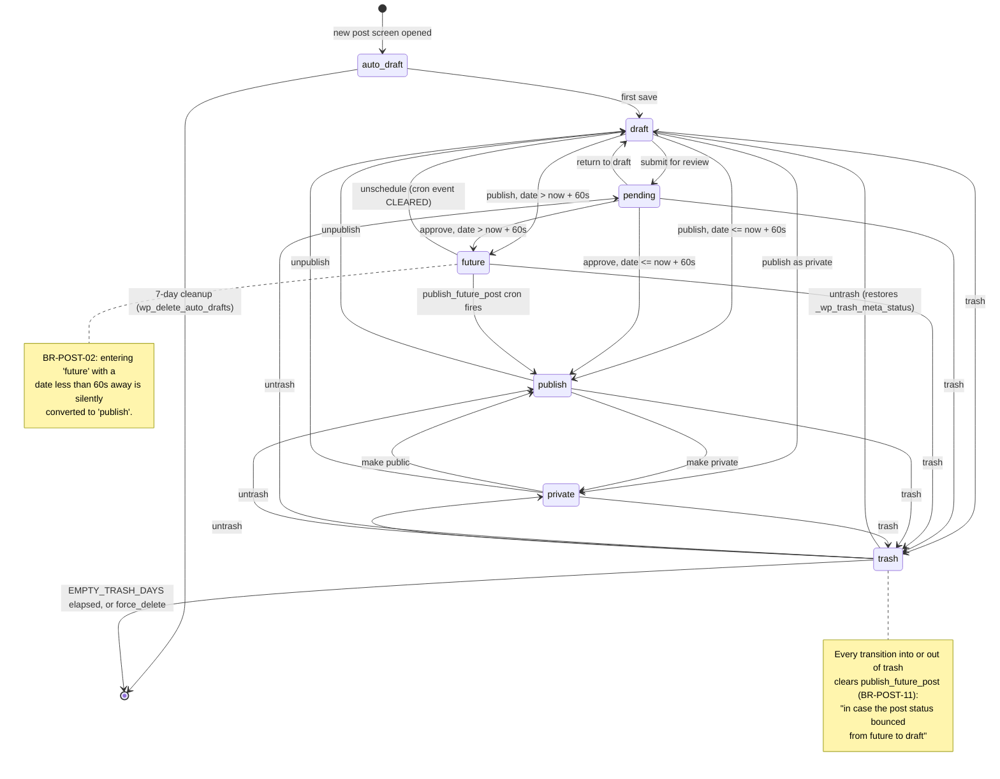
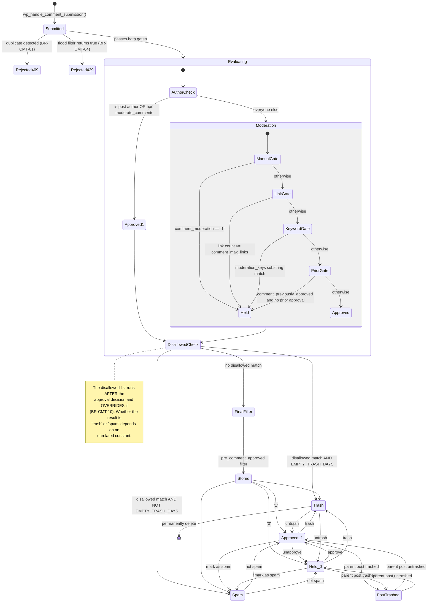
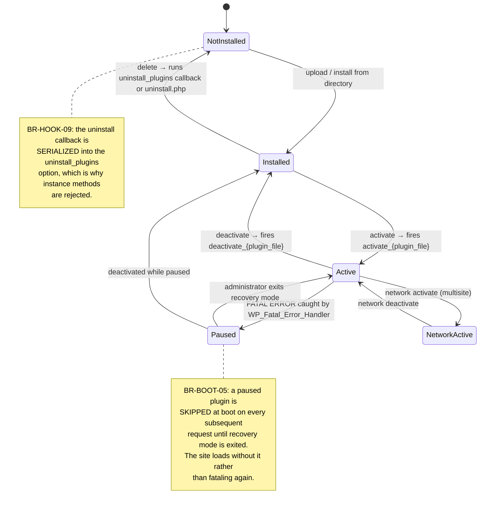
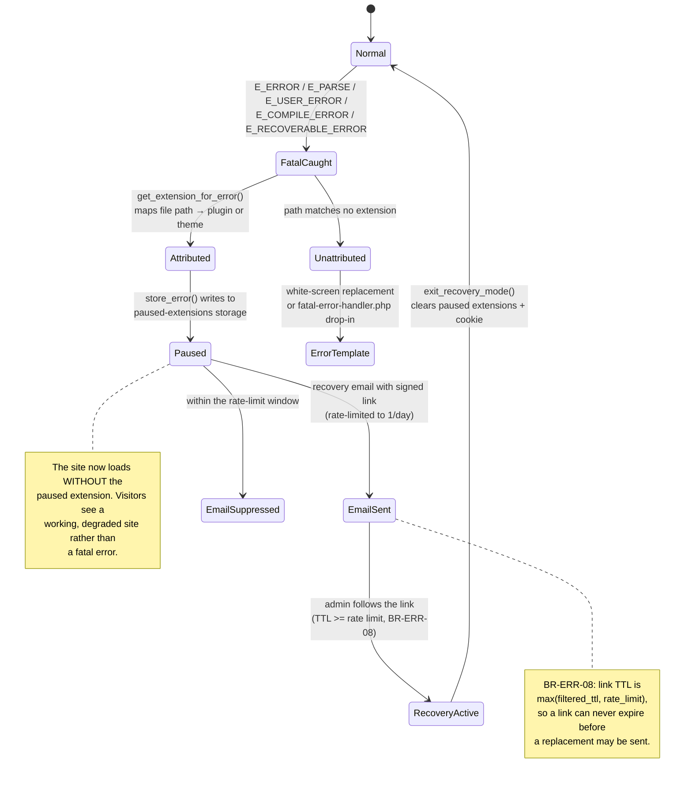
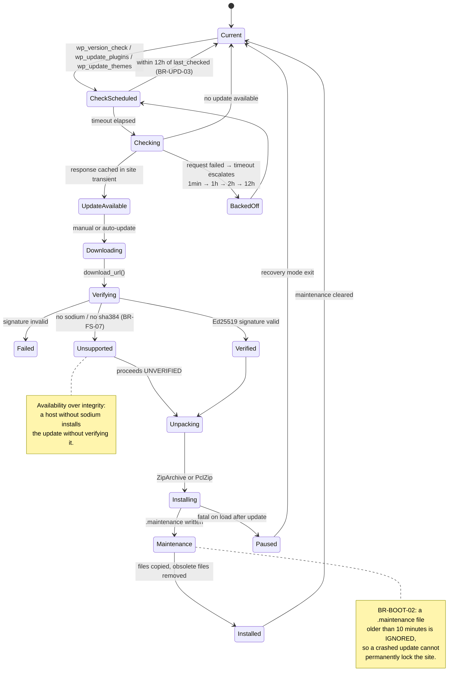
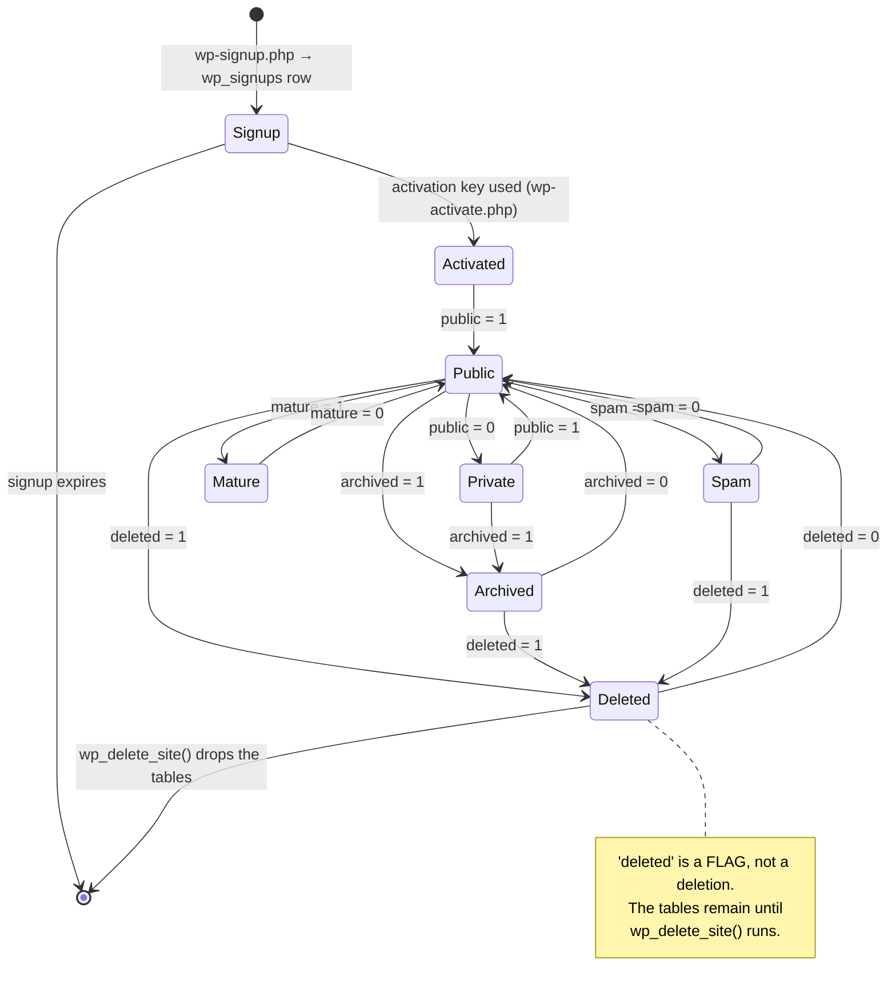

# State Machines — WordPress

> Generated by the **Detective** (Reversa) · doc_level `complete`
> Confidence: 🟢 CONFIRMED (transitions read from code) · 🟡 INFERRED · 🔴 GAP

---

## 1. Post status

**The most important state machine in WordPress**, and an unusual one: the state is *computed*, not
assigned (BR-POST-01/02).

### States 🟢

| Status | Meaning | Public? |
|--------|---------|---------|
| `auto-draft` | Row created before the user typed anything. Garbage-collected after 7 days. | ❌ |
| `draft` | Unpublished work in progress. No slug generated. | ❌ |
| `pending` | Awaiting editorial review. No slug generated. | ❌ |
| `future` | Scheduled. A `publish_future_post` cron event is pending. | ❌ |
| `publish` | Live. | ✅ |
| `private` | Live but visible only to users with `read_private_posts`. | ❌ |
| `trash` | Soft-deleted; original status preserved in `_wp_trash_meta_status`. | ❌ |
| `inherit` | Attachments and revisions — the effective status is the parent's. | — |
| `request-pending` / `request-confirmed` / `request-failed` | GDPR `user_request` posts only. | ❌ |

### Transitions 🟢



### The 60-second rule 🟢

The `draft → publish` and `draft → future` edges are **not chosen by the caller**. `wp_insert_post()`
computes them:

```
publish requested, post_date_gmt - now >= 60s   → status becomes 'future'
future  requested, post_date_gmt - now <  60s   → status becomes 'publish'
```

### Side effects on every transition 🟢

`wp_transition_post_status()` fires `transition_post_status` **and** the dynamic
`{$old}_to_{$new}` action — 11 statuses generate up to **121 undeclared hook names** (F-POST-04).

`_transition_post_status()` then:

1. Seeds `guid` from `get_permalink()` on first entry to `publish` — once, never again.
2. Invalidates `lastpostmodified` / `lastpostdate` for `server`, `gmt` and `blog` timezones.
3. Invalidates post-count caches.
4. **Unconditionally** clears `publish_future_post`.

---

## 2. Comment approval

### States 🟢

`comment_approved` is a **varchar**, not a boolean (BR-CMT-12):

| Value | Meaning |
|-------|---------|
| `'1'` | Approved and displayed |
| `'0'` | Held for moderation |
| `'spam'` | Marked as spam |
| `'trash'` | Soft-deleted |
| `'post-trashed'` | The parent post was trashed; restored when the post is untrashed |

### The approval decision 🟢



**Note the ordering:** the author/moderator exemption (BR-CMT-05) skips all four moderation rules but
**not** the disallowed-list check. An administrator's comment containing a disallowed word is still
trashed.

---

## 3. Plugin lifecycle

### States 🟢



**Load order at boot** (BR-BOOT-06 and `wp-settings.php`):

```
mu-plugins → network plugins → [muplugins_loaded] → active plugins
→ pluggable.php → [plugins_loaded]
```

`pluggable.php` loading *after* active plugins is what makes the 35 security functions replaceable.

---

## 4. Recovery mode



---

## 5. Update lifecycle



---

## 6. Multisite site status



`wp_blogs` carries five independent boolean flags — `public`, `archived`, `mature`, `spam`,
`deleted` — so a site's "state" is a **combination**, not a single value. 🟢

---

## 7. Findings

| # | Finding | Confidence |
|---|---------|-----------|
| F-SM-01 | Post status is the only state machine in WordPress where the *machine itself* decides the state from a data value rather than from the requested transition. | 🟢 |
| F-SM-02 | The `{$old}_to_{$new}` dynamic hook means 121 transition hooks exist that no static analysis can enumerate — they are generated from the status registry at runtime. | 🟢 |
| F-SM-03 | Comment approval has two sequential decision layers (moderation, then disallowed list) where the second overrides the first. The author/moderator exemption bypasses only the first. | 🟢 |
| F-SM-04 | Multisite site state is five independent flags, not an enum, so 32 combinations are representable and only a handful are meaningful. | 🟡 |
| F-SM-05 | Every failure path in the update and recovery machines has a self-healing escape (stale maintenance file, rate-limit-bounded link TTL, paused-extension skip), which is why WordPress rarely stays broken. | 🟢 |
